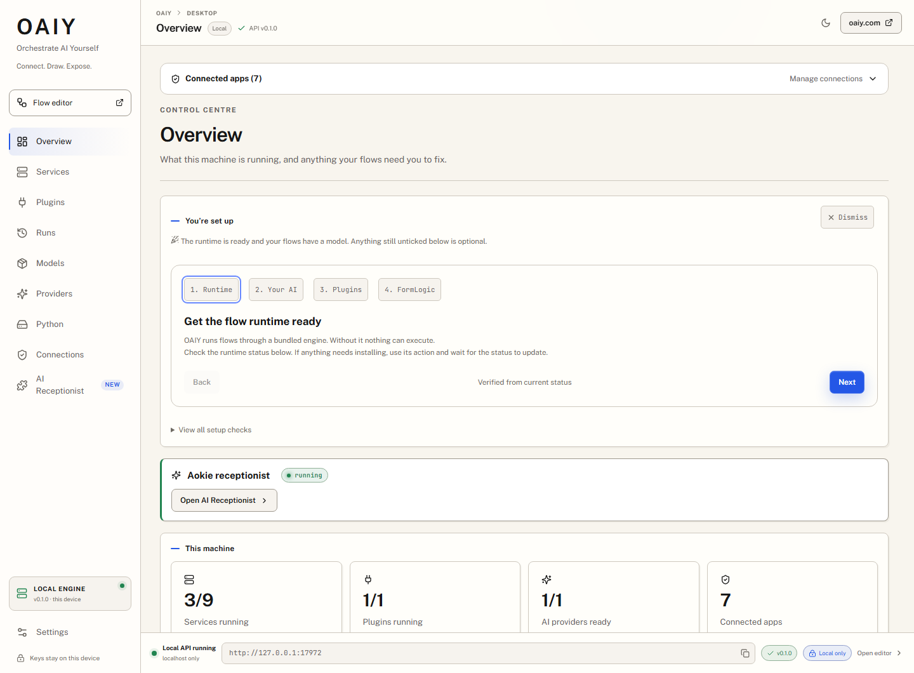
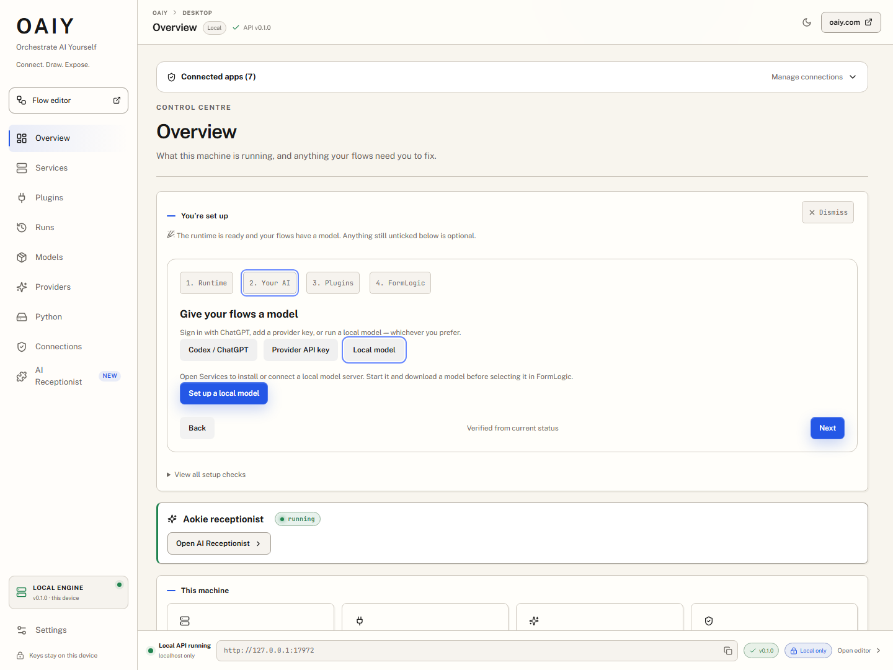
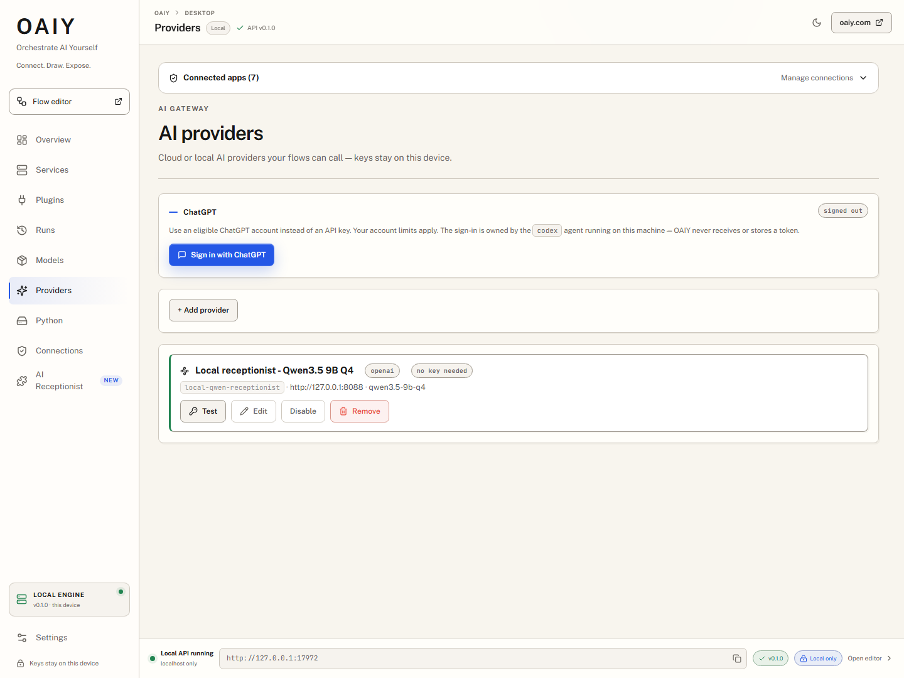

# OAIY — Orchestrate AI Yourself

**Connect your AI. Build a flow. Put it to work.**

OAIY brings a visual flow editor, local AI services, provider connections and
device plugins into one workspace. Use a local model, an API provider or your
ChatGPT account through Codex. Run flows in the browser or through OAIY Desktop,
and connect apps such as FormLogic to the runtime on your own machine.

[Desktop setup](#set-up-your-ai) · [FormLogic and Aokie](#connect-formlogic-and-aokie) ·
[Develop locally](#quick-start) · [CLI guide](cli/README.md) ·
[Bridge protocol](protocol/README.md)



*The running desktop workspace. Overview brings setup, service health, plugins
and connected apps together.*

## What you can do

- **Build visual flows.** Connect model calls, HTTP requests, data processing and
  device actions in the browser editor, then inspect their runs.
- **Bring your own AI.** Choose an OpenAI-compatible or Anthropic API provider,
  a local model server, or OAIY's managed Codex connection.
- **Manage the local runtime.** Install and start services, download models,
  manage Python environments and inspect logs from OAIY Desktop.
- **Connect apps and devices.** Approve browser connections, link a FormLogic
  account and install plugins such as Aokie for phone features.
- **Run without the editor.** The CLI and headless desktop server use the same
  flow engine as the web app. The optional PHP backend adds shared flows and a
  remote run queue.

## Set up your AI

Open **Overview** in OAIY Desktop and follow the setup guide: **Runtime → Your
AI → Plugins → FormLogic**. It derives progress from the current runtime and
configuration; plugins and app connections are optional.



*The actual setup wizard with Local model selected. Choose the connection that
fits your existing setup.*

| Connection | How to set it up |
|---|---|
| **Codex / ChatGPT** | Select this option and use **Sign in with ChatGPT**. The wizard links to the Codex CLI installation guide if the CLI is missing. OAIY manages a separate Codex session; the CLI owns sign-in and credentials. Your eligible account's limits apply. |
| **Provider API key** | Open **Providers → Add provider**, choose the protocol, enter the endpoint, model and key, then use **Test**. Provider keys are stored on the desktop and injected into outbound requests by its gateway. Provider charges may apply. |
| **Local model** | Open **Services** to install or connect a model server, then use **Models** to download its model. Start the service and select it in your flow or connected app. Existing local OpenAI-compatible endpoints can also be added in **Providers**. |



*A real local configuration using Qwen3.5 9B Q4. The model and endpoint shown are
an example from the development machine, not a required model or bundled
download. All screenshots were captured from the running app with live API
responses; no mock data was substituted.*

Use **Test** to check a provider's actual response after configuring it. A saved
provider or green setup check is not a substitute for an inference test.
GPU use depends on the model server and its configuration; OAIY's llama.cpp
installer selects a CUDA build when it detects an NVIDIA GPU on Windows.

## Connect FormLogic and Aokie

FormLogic provides the hosted app, forms, records and backend logic. OAIY
provides local model access, flow execution and device plugins. They connect
through the [OAIY Bridge protocol](protocol/README.md).

1. In FormLogic, open **Connect your AI**, choose **OAIY desktop** and start the
   connection. In OAIY **Connections**, check the matching code and approve it.
2. Return to FormLogic, select the provider and verify the connection. Keep
   OAIY running while your app uses its local services.
3. For account-backed records and automations, complete **Connections → Linked
   account** as well. Approval happens in the provider's browser page; OAIY
   receives a scoped key. This account link is separate from granting a browser
   access to the local runtime.
4. For phone features, install the Aokie plugin through **Plugins**, start it and
   open **AI Receptionist**. Its setup guides you through the phone connection
   and speech, model and voice providers.
5. In FormLogic, configure the Aokie app's forms and event-to-flow bindings.
   Plugin events can trigger those linked flows, and the configured app records
   calls, transcripts and appointments in its workspace. Inspect **Runs** and
   plugin logs in OAIY when a step needs attention.

Aokie's phone features need compatible phone hardware and configured speech
services. Its local speech pipeline can combine separate STT, LLM and TTS
services. OAIY's provider gateway currently exposes chat completions; it does
not provide a realtime WebSocket proxy. Provider choices report the host's
supported capabilities.

Review or revoke app access in **Connections**. Linked flows run with the
permissions granted to their account and plugin; install and approve only the
connections you intend to use.

### Use OAIY from another computer or phone

In OAIY, open **Connections → Linked account** and link your FormLogic site.
In FormLogic's **Connect your AI** wizard, choose **Through my FormLogic account**.
OAIY makes outbound HTTPS connections to the site; your browser does not need
to reach OAIY's localhost port, and no inbound port forwarding is required.

For a saved automation, choose **Desktop relay**, then select its **Linked
computer** in the test panel. AI requests and relay flow inputs/results are
encrypted end to end. Service/plugin commands and account records use the
authenticated HTTPS API. Keep OAIY running while using it remotely.

See [remote FormLogic setup and encryption boundaries](docs/REMOTE_FORMLOGIC.md)
for machine assignments, diagnostics and developer checks.

## How the pieces fit

The browser editor stores your working flows locally and executes them against
your configured services. Desktop adds the processes and device access a
browser cannot manage on its own. Its authenticated local API is the connection
point for approved apps; linked accounts supply the scoped access for remote
events, records and flows.

The separate `api/` PHP service stores shared flow snapshots and queues run
requests. A browser dispatcher or CLI worker picks up those requests and runs
them against its configured services. Model inference happens at the selected
provider or local model server.

## Repo layout

```
.
├── ui/        # React + Vite + TypeScript frontend (the visual flow builder)
├── cli/       # Headless Node CLI — run flows on a server with no browser (`oaiy`)
├── api/       # PHP 8.1+ / Slim 4 backend — sharing + AI-driven runs (SQLite or MySQL)
├── desktop/   # Tauri 2 desktop app (OAIY Desktop) + `oaiy-server` headless binary — manages local
│              #   model servers, Python venvs, model downloads + the browser sidecar
├── .gitignore
└── README.md  # you are here
```

The parts are independently deployable. `ui/` runs standalone (no backend) and gives the full flow-builder experience; `api/` adds shareable hash URLs + remote AI control; the optional `desktop/` app (OAIY Desktop) lets the browser app drive local model servers, Python, and `browser_*` nodes over a localhost API (see `desktop/README.md`).

**Run flows without a browser.** `cli/` shares the *exact same* `oaiy-core` engine as `ui/` via a Node host adapter, so a flow runs identically headless — `oaiy run flow.json` (or `.oaiy`), or `oaiy worker` to drive the `api/` run-queue on a server. The `desktop/` crate also builds **`oaiy-server`**, OAIY Desktop's service/model API with no GUI, for the same server deployments. See `cli/README.md`.

## Quick start

### Desktop (`desktop/`)

For a packaged app, use an installer from the repository's
[Releases](https://github.com/f2i-com/oaiy.com/releases) when available. For local
development, install Node.js, a stable Rust toolchain and the platform's Tauri
build prerequisites. Windows needs the Visual Studio C++ build tools and
WebView2.

```bash
cd desktop
npm ci
npm run tauri:dev
```

The desktop API uses `http://127.0.0.1:17972` by default. Browser apps pair through
**Connections**; the headless server requires `OAIY_SERVER_TOKEN` for protected
API routes. See the [desktop guide](desktop/README.md) for platform setup,
service templates, data storage and headless deployment.

### Frontend (`ui/`)

Use a current Node.js LTS release and npm; the release workflow uses Node 24.
The ZIPP installer that `ui`'s hooks run reads zips with `zlib.crc32`, so it
needs Node 20.15, 22.2 or newer, and `npm test` runs TypeScript directly, which
needs Node 22.18 or newer.

```bash
cd ui
npm install
npm run dev               # http://localhost:5173 (Vite default)
```

Open `/` for the site or `/app.html` for the flow editor.

`ui/` is fully standalone — there is **no** sibling-monorepo dependency. The `oaiy-core` engine and `oaiy-ui-components` are vendored under `ui/vendor/`, and the bundled node modules live under `ui/src/bundled-modules/`; both are resolved via the aliases in `ui/vite.config.ts`. `npm install && npm run dev` works on its own, palette and all.

Production build:

```bash
cd ui
npm run build             # writes ui/dist/
```

Drop `ui/dist/` behind any static host (S3, Netlify, Cloudflare Pages, nginx, …). No SSR, no server-side rendering.

### Backend (`api/`)

Requires PHP 8.1+, Composer, and one of: **SQLite** (default — zero setup, ships with PHP) or **MySQL 5.7+ / MariaDB 10.3+**.

```bash
cd api
composer install
cp .env.example .env      # SQLite by default; flip DB_DRIVER=mysql if you want MySQL
php bin/migrate.php       # driver-aware: handles both SQLite + MySQL schemas
php -S 0.0.0.0:8081 -t public/   # or hand public/ to nginx/Apache
```

`:8081`, not `:8080`, because llama.cpp — a service OAIY downloads and launches
for you — binds `:8080` by default. Note also that `php -S` is single-threaded
and the run long-poll holds a request open for 20s, so it blocks every other
request; it is fine for poking at the API alone, but see `api/README.md` before
running the UI against it.

The driver-aware migration runner reads `DB_DRIVER` from `.env` and applies the matching schema (`migrations/001_initial.sqlite.sql` or `001_initial.sql`). SQLite stores at `api/var/oaiy.sqlite` by default. The router lives at `public/index.php`; everything else is under `src/`.

### Pointing the UI at the backend

The frontend talks to the backend over HTTP. Set `VITE_API_BASE` at build time (or in `ui/.env.development.local` for dev):

```
VITE_API_BASE=http://localhost:8081
```

> **Put a dev-only value in `ui/.env.development.local`, not `ui/.env.local`.**
> Vite loads `.env.local` for `vite build` as well as `vite dev`, so a localhost
> URL there gets baked into your production bundle — and because a non-empty
> `VITE_API_BASE` is what switches the sharing code path on, the built app then
> tries to reach a backend that only exists on your machine. Both filenames are
> gitignored; only `.env.development.local` is dev-scoped.

If `VITE_API_BASE` is empty, the frontend skips all backend calls and operates purely locally (no sharing, no remote dispatch). When set, sharing is still **off by default** — flip the toggle in **Settings → Defaults → Sharing & remote runs** to enable it. The Test Connection button in that panel verifies the backend is reachable.

## How the sharing model works

A flow lives in 3 places:

1. The user's **browser** (`localStorage` + React state) — source of truth while editing.
2. The **backend** (one row per flow, SQLite or MySQL) — a JSON snapshot, indexed by two random hashes.
3. **Anywhere else** the user pastes the URL.

Each shared flow gets **two** hashes (110 bits of entropy each, Crockford base32):

- `hash_view` — read-only. Anyone with this URL can see the flow but can't change it.
- `hash_edit` — read-write. Anyone with this URL can edit the graph AND queue runs that the original user's browser picks up (when that browser is online with the flow open).

The Share dialog (header button when sharing is enabled) calls `POST /api/flows`, stores both hashes + an `owner_token` in localStorage, and surfaces the two URLs with copy buttons. Treat the edit hash like a key — anyone holding it can spend your local compute.

### Optional password encryption

Setting a password on the Share dialog enables **AES-GCM (256-bit) + PBKDF2-SHA256 (600k iters)** client-side encryption. The backend never sees plaintext — only an opaque envelope `{$enc, kdf, iter, salt, iv, ct}`. Opening an encrypted shared link triggers a password prompt; wrong-password decrypt is detected by GCM auth-tag failure and re-prompts up to 5 times. Lose the password = lose the flow (we genuinely can't recover it).

### Driving a flow from an AI

Hand any HTTP-capable AI the **edit URL** plus a one-shot prompt:

> Read `https://api.oaiy.com/api/flows/<hash_edit>/manifest` — that gives you the current graph + the inputs the flow accepts + the node catalogue. Build a payload that fills the inputs. POST it to `https://api.oaiy.com/api/flows/<hash_edit>/runs`. The response carries a `poll` path — follow it (`https://api.oaiy.com/api/flows/<hash_edit>/runs/<id>`) until status is `done` or `error`. Runs are flow-scoped, so the hash is part of the poll URL.

The browser dispatcher (`ui/src/lib/backendDispatcher.ts`) long-polls `/api/flows/<hash_edit>/runs/pending` (~20s window per request). When a queued run appears it claims it atomically (optimistic concurrency on the `runs` table), hands it to the local executor, and POSTs the result back to `/api/runs/<id>/result`. Encrypted flows have their inputs/results encrypted in-transit the same way the flow body is.

> **Status note:** the full remote-run path is wired end-to-end. The dispatcher loop, long-poll, atomic claim, heartbeat, and encrypt/decrypt all work, and the local-execution callback (`OAIYApp`'s `executeRun`) resolves the shared flow, submits it to the live JobQueue runtime (`submitJob` → `subscribeToJob`), and POSTs the real result back — with a 10-minute browser-side timeout so a stuck run can't hang the caller. See `ui/src/hooks/useBackendIntegration.ts` and `ui/src/components/OAIYApp.tsx`.

## API reference

All routes are JSON in / JSON out. Both `hash_view` and `hash_edit` accept the same read endpoints; write/run endpoints require the edit hash.

| Method | Path | Notes |
|--------|------|-------|
| `POST` | `/api/flows` | Create a new flow. Body: `{title, flow_json}`. Returns `{hash_view, hash_edit, owner_token}`. Store the `owner_token` — it's required for `DELETE` (sent back via the `X-Owner-Token` header). |
| `GET` | `/api/flows/{hash}` | Read a flow by either hash. |
| `PUT` | `/api/flows/{hash_edit}` | Replace the flow's JSON. |
| `DELETE` | `/api/flows/{hash_edit}` | Delete a flow. Requires the `owner_token` via the `X-Owner-Token` header. |
| `GET` | `/api/flows/{hash}/status` | `{client_connected, last_seen}` — tells an external caller whether a browser is online to execute runs. |
| `GET` | `/api/flows/{hash}/manifest` | AI-friendly spec sheet — the graph + inputs + node catalogue, with documentation. Paste this URL into ChatGPT/Claude. |
| `POST` | `/api/flows/{hash_edit}/runs` | Enqueue a run. Body: `{inputs: {...}}`. Returns `{run_id, status: 'queued', poll}` — follow the `poll` URL. |
| `GET` | `/api/flows/{hash}/runs/{run_id}` | Poll a run (either hash). Returns `{status, result, error, finished_at}`. Scoped to the flow, so run ids aren't enumerable across flows. |
| `GET` | `/api/flows/{hash_edit}/runs/pending` | **Browser-side only.** Long-polls for queued runs. Returns the next one or `null` after the timeout. |
| `POST` | `/api/runs/{run_id}/result` | **Browser-side only.** Reports the execution outcome. Requires the flow's edit hash in the body (`{hash}`). |
| `POST` | `/api/flows/{hash_edit}/heartbeat` | **Browser-side only.** Mark the client as online. Called every ~30s while the flow is open. |
| `GET` | `/api/service-library` | List the built-in shareable service templates (read-only; backed by `api/service-library/*.json`). |
| `GET` | `/api/service-library/{file}` | Download one service-template `.json` from the library. |

## Security model

- **Hashes are the auth.** 22-character Crockford base32 = 110 bits of entropy each, never enumerable from anywhere on the site.
- The **edit hash grants run-trigger ability**, which spends the original user's local compute + their registered Services (potentially their API keys).
- **Password-encrypted flows** keep the body off the server entirely — the backend stores only the AES-GCM ciphertext envelope. Lose the password, lose the flow.
- The backend never sees Services' secret values — the oaiy-core compiler resolves `apiKeyConstant` against the user's *local* constants registry at execution time.
- **Rate limits** are enforced: the backend caps queued-runs-per-hash (default 10, `MAX_QUEUED_RUNS` in `.env`) atomically, so concurrent enqueues can't race past the cap; excess returns 429. CORS defaults to `*` so external tools can POST from anywhere; tighten `CORS_ALLOW_ORIGIN` in production if you want flows only drivable from your own tools.
- **Runs are flow-scoped.** Polling a run requires the flow's hash (`GET /api/flows/{hash}/runs/{id}`) and reporting a result requires the edit hash, so sequential run ids can't be walked to read or forge another flow's runs.
- **Stale runs self-heal.** A run left in `running` because its browser tab died is reset to a terminal `error` after `RUN_TTL` seconds (default 900), so an external poller always reaches a terminal status.
- The `owner_token` (returned from create, replayed via the `X-Owner-Token` header) is the only thing that authorises `DELETE` on a flow — the hashes alone are read+update only.

### Running untrusted package code

Flows you build yourself are trusted — they are your code, running on your machine. Flows that arrive **inside an installed package** are not, and they get a different execution path (`isHardened`, set when a job carries a `packageId`):

1. Every capability is brokered. Package code cannot call anything directly; it goes through `host.call(kind, …)`, and each `kind` is checked against the package's declared permissions. An unclassified method is **refused**, not allowed through.
2. It runs in a Web Worker, in its own realm, with the network and worker-spawning globals removed and the source scanned for escape patterns. Hardened code that cannot get a Worker is refused rather than downgraded.
3. Optionally, it runs on a different **engine** entirely.

That third layer is **Settings → Defaults → Flow sandbox**, on by default, and it applies to **your own flows too**. It swaps the JavaScript engine for [ZIPP](https://github.com/f2i-com/zipp.org/releases) compiled to WebAssembly (the JavaScript-only bundle of ZIPP's latest release, installed and checksum-verified at build time by `scripts/fetch-zipp-release.mjs`), running in a Worker. The distinction is worth being precise about: layer 2 is *subtractive* — a full browser realm with the dangerous names taken away one at a time, which both layers' own comments describe as best-effort. Zipp's guest global is a positive allowlist that never held a host object, so a script that successfully reconstructs `globalThis` finds no `fetch`, no `Worker`, no `importScripts`. Not hidden — absent. Zipp also enforces an instruction budget, so a runaway loop stops itself instead of pinning a core until you abort.

It costs a one-off ~1.8 MB engine download on the first flow run (lazy — nothing is fetched until then), interpreted rather than JIT-compiled execution, and a ~16 MiB ceiling on any single value crossing the boundary. The compiled flow script itself is unchanged: OAIY's generator trampoline already talks to the host through exactly the `host.call(kind, args, cb)` contract Zipp's preamble provides. Code nodes get the pure text and encoding helpers (`TextEncoder`/`TextDecoder`, `atob`/`btoa`, `structuredClone`, `queueMicrotask`, `performance.now`) from a wrapper; `fetch`, `XMLHttpRequest`, `WebSocket` and timers throw a clear error pointing at the node to use instead — Zipp's own `setTimeout` with a delay would otherwise try to sleep a thread WebAssembly does not have. With the toggle off, your own flows run in-thread on the browser engine as before, and package flows use the plain isolated Worker. See `ui/vendor/oaiy-core/src/zipp-executor.ts`.

**The `cli/` runner has the third layer only, and always.** Every flow the CLI runs — `oaiy run`, `oaiy worker`, the Desktop's background flows and app-logic scripts (once the Desktop stages `cli/dist/zipp/` and the worker shell beside `oaiy.mjs`; until then it is told `engine_unavailable`) — runs on the web-python bundle of the same ZIPP release, in a `worker_threads` Worker started with an empty environment. There is no other path: `createCliEngine` (`cli/src/engine.ts`) is the only way the CLI builds a runtime, it fixes the ZIPP executor and `requireScriptExecutor` last, and a missing or altered engine artifact is `engine_unavailable` before any job exists rather than a fall back to the host's own JavaScript. To flow code, `process`, `require`, `Buffer` and `__TAURI__` are `undefined`, so a token in the CLI's environment is out of reach. What a flow can still do is what its nodes may ask the host for — the same brokered module calls a flow of your own makes — which is why `flow-io.ts` still refuses custom-node packages outright (the CLI does not compile them). `oaiy run --instruction-budget <steps>` sizes the per-entry instruction budget (1 to the engine's ceiling, both reported by `oaiy capabilities --json`, which also says whether the staged engine checks); a run the host ends carries `errorCode` (`timeout`, `engine_unavailable`) beside `engine: "zipp"` in its result. `cli/test/` holds the guards that keep this true — no host `Function`/`eval`/`node:vm` in the bundles, a tripwire that counts them at run time across every thread, the realm canary, and a build that deliberately runs the same canary on the host engine to show the guards can tell the difference. See [TESTING.md](TESTING.md#cli-on-zipp-guards-and-boundary-measurements).

## Testing

Run checks manually from the directory shown after installing its dependencies.
Automatic push and pull-request CI is temporarily paused; the
[CI workflow](.github/workflows/ci.yml) can still be started manually with
`workflow_dispatch`.

| Directory | Command | Coverage / requirements |
|---|---|---|
| `desktop/` | `npm test` | Desktop UI and integration contracts |
| `desktop/` | `npm run build` | CLI resource sync, TypeScript and desktop UI build |
| `desktop/src-tauri/` | `cargo test --no-default-features --lib` | Runtime, gateway, plugins and account links without GUI dependencies |
| `cli/` | `npm test` | Headless flow engine and host adapters on ZIPP; the ZIPP process-boundary suite, the engine guards (no host eval, wiring, canary under a tripwire, budget, timeout, `engine_unavailable`) and the boundary measurements (needs `npm run build` first — the guards spawn and read `dist/`) |
| `ui/` | `npm test` | Installs the ZIPP engines if needed; TypeScript, CSS tokens, node contracts, both ZIPP engines and Zipp sandbox routing |
| `ui/` | `npm run test:e2e` | Browser checks; needs the web dev server |
| `api/` | `composer test` | API smoke tests; needs a running API and migrated development database |

See [`TESTING.md`](TESTING.md) for API and browser test setup. Hardware, model
quality and real phone audio still need integration checks against the chosen
services and devices.

## Releases

Tag a version and GitHub Actions builds the whole release (`.github/workflows/release.yml`):

```bash
git tag 0.0.1
git push origin 0.0.1
```

The tag is the version — it is stamped into the desktop app at build time, so no release commit is needed. The release for that tag carries:

| File | What it is |
|------|------------|
| `oaiy-web-<v>.zip` / `.tar.gz` | The compiled static site: landing page at `/`, flow builder at `/app.html`, desktop page at `/desktop.html`. Unzip onto any static host. |
| `oaiy-desktop-<v>-windows-x64-setup.exe`, `.msi` | OAIY Desktop for Windows |
| `oaiy-desktop-<v>-linux-x86_64.AppImage`, `-amd64.deb`, `-x86_64.rpm` | OAIY Desktop for Linux |
| `oaiy-server-<v>-linux-x86_64.tar.gz`, `-windows-x64.zip` | The headless server, no GUI or GTK, for hosts driven by the CLI or a hosted web app |
| `SHA256SUMS.txt` | Checksums for everything above |

The web build is standalone (`VITE_API_BASE` unset) unless a repository Actions
variable named `VITE_API_BASE` is set. Tag-triggered release publishing remains
enabled while ordinary CI is paused. The release workflow also supports manual
builds without publishing a release.

## License

Licensed under the **Apache License 2.0** — see [`LICENSE`](LICENSE) and
[`NOTICE`](NOTICE). Copyright 2026 oaiy.com.

You may use, modify and redistribute this code, including commercially,
provided you keep the license and copyright notices, state your changes, and
don't use the OAIY name or marks to endorse your derivative (Apache-2.0 §6).
The license also carries an express patent grant from contributors.

The two fonts bundled in `desktop/public/fonts/` are **SIL OFL 1.1**, not
Apache-2.0 — their license texts ship alongside them. OFL imposes nothing on the
surrounding code; see `NOTICE` and `desktop/public/fonts/README.md`.
