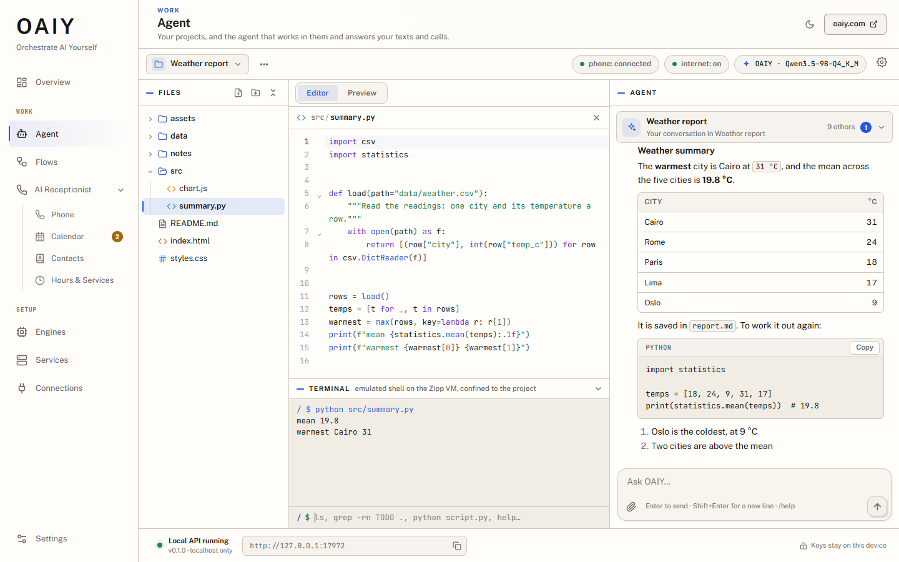
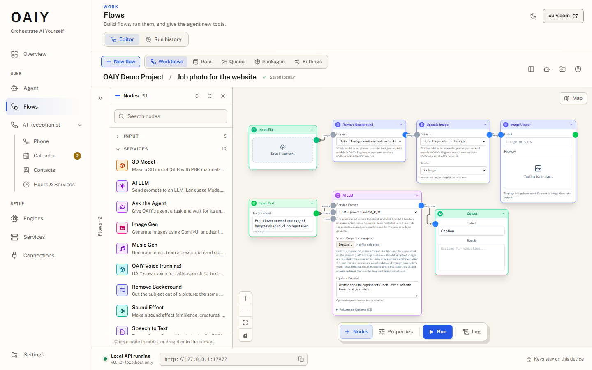
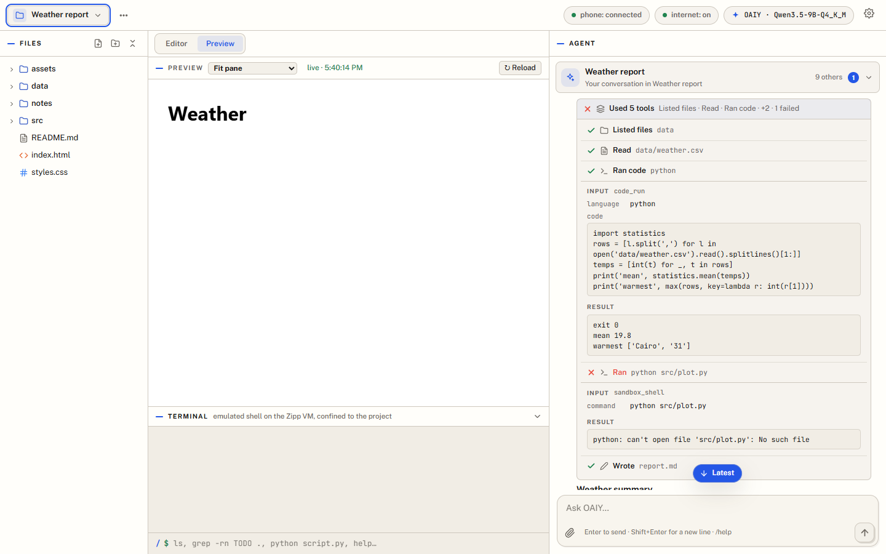
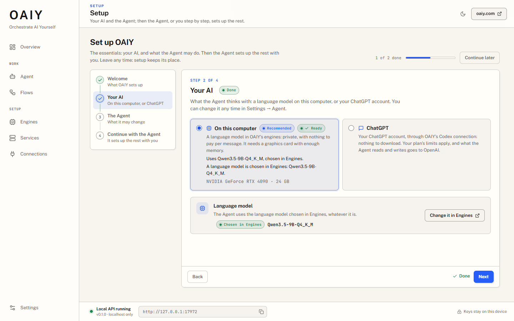
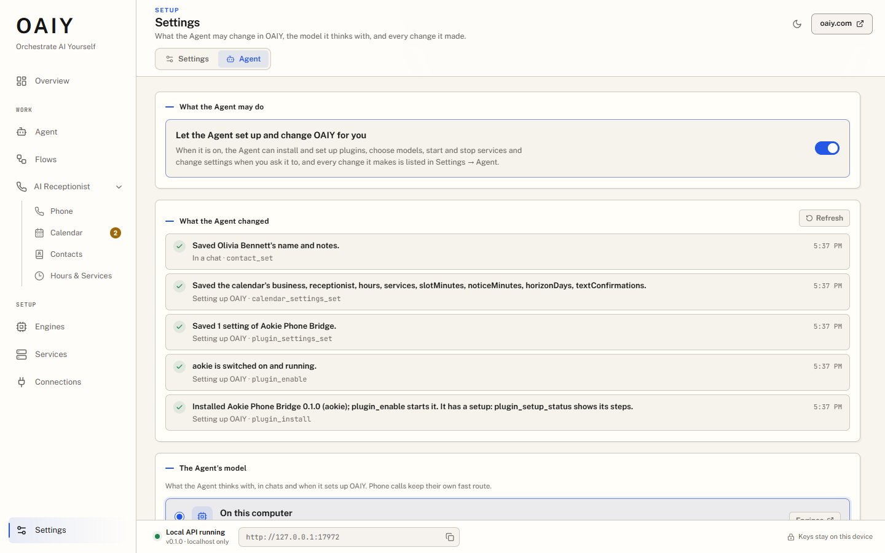
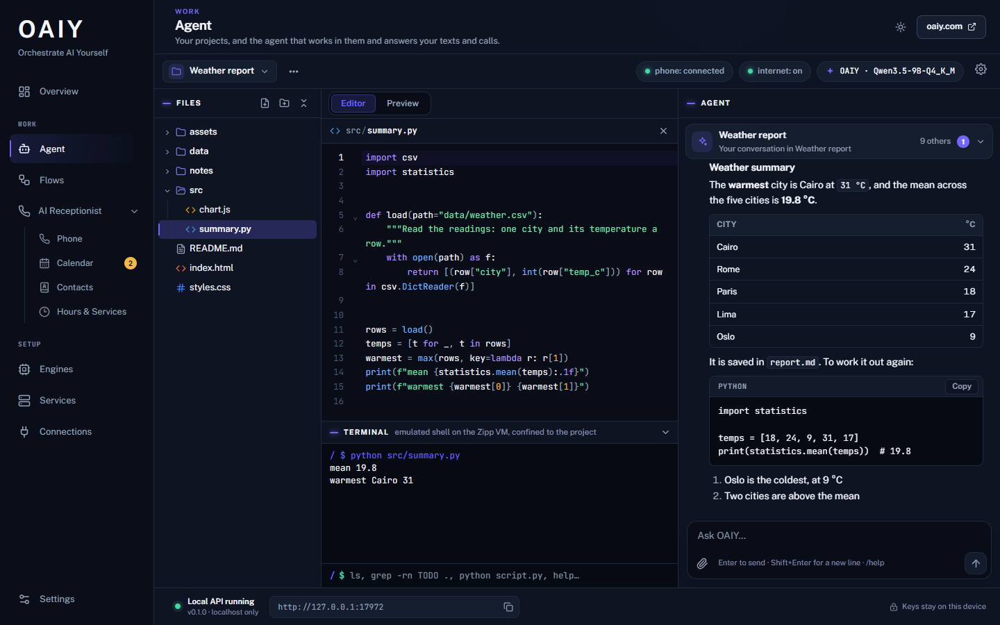
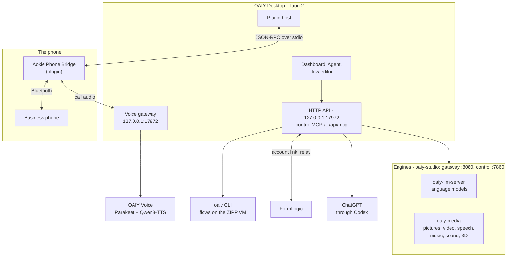

# OAIY — Orchestrate AI Yourself

**Your AI, on your own computer.** OAIY is one desktop app with an agent that works in
your projects and answers your business's phone, the models it runs on your GPU, a
flow editor for automations, and the plugins and connections around them.



<p align="center">
<a href="#what-it-does">What it does</a> ·
<a href="#how-the-parts-fit">How the parts fit</a> ·
<a href="#getting-started">Getting started</a> ·
<a href="#repository-layout">Repository layout</a> ·
<a href="docs/README.md">Documentation</a>
</p>

- **An agent that does the work.** Give it a task in a project: it plans the steps, works
  through them one at a time, checks each one, and keeps you posted. It writes and runs
  code on the Zipp VM, builds web pages and SoftN apps with a live preview, and makes
  pictures, video, speech, music, sound effects and 3D models. It thinks with the model
  chosen in OAIY's engines, or with your ChatGPT account.
- **A receptionist for your phone.** With the Aokie Phone Bridge plugin, the Agent answers
  your business's calls and texts in its own voice, books appointments into a calendar
  you confirm, remembers the people who get in touch, and rings or texts a list of
  people for you.
- **Models on your own hardware.** OAIY's engines are written in Rust: language models
  (streaming mixture-of-experts weights from the NVMe when a model does not fit on the
  GPU) and pictures, video, speech, music, sound effects, 3D models, background removal
  and upscaling, behind OpenAI-style endpoints.
- **Flows.** Build automations in the flow editor, with the engine's models as nodes of
  their own. A flow can be a tool the Agent uses, and a flow can hand a task to the Agent.
- **The Agent sets OAIY up.** Setup asks only for the essentials, then the Agent sets up
  the rest with you in a chat, through OAIY's own control API.

## Screenshots

<table>
<tr>
<td width="50%"><br><b>Overview.</b> Today on this computer: the phone, the model, the next appointment, and what needs you.</td>
<td width="50%"><br><b>Flows.</b> The flow editor, with the engine's models as typed nodes in the palette.</td>
</tr>
<tr>
<td><br><b>The Agent at work.</b> Each tool it used, with its input and result.</td>
<td><br><b>A call.</b> The receptionist's side of a phone call, as it happens.</td>
</tr>
<tr>
<td><br><b>Calendar.</b> Appointments, and the requests calls and texts bring in for you to confirm.</td>
<td><br><b>Hours &amp; Services.</b> The business as the receptionist tells callers.</td>
</tr>
<tr>
<td><br><b>Contacts.</b> Names, your notes, and what the receptionist remembered.</td>
<td><br><b>Outreach.</b> Calls with an objective, worked down a list, with the results.</td>
</tr>
<tr>
<td><br><b>Setup.</b> The essentials first: your AI, and what the Agent may change.</td>
<td><br><b>Settings → Agent.</b> What the Agent may change, and everything it changed.</td>
</tr>
</table>

<p align="center"><br><sub>The dark theme.</sub></p>

<sub>The screenshots are from a demo setup: the business, the people and their numbers are
made up (the numbers are ones the ACMA keeps for fiction), and the phone and the engines
are stand-ins. See [docs/README.md](docs/README.md#pictures).</sub>

## What it does

### OAIY Desktop

A Tauri 2 app for Windows and Linux (the Windows installers are the better tested), with its HTTP API (axum) on `127.0.0.1:17972`. Its sidebar:

- **Overview:** the phone, the language model, the next appointment, requests to
  confirm, plugins and services.
- **Work:**
  - **Agent:** the Agent app (below).
  - **Flows:** the flow editor, and the history of every flow run.
  - **AI Receptionist:** Phone, Calendar, Contacts, and Hours & Services, while a plugin
    provides the phone and the calendar.
- **Setup:**
  - **Engines:** the engines' own control pages, and model files.
  - **Services:** local services to install, start and stop (OAIY Voice, a Playwright
    browser, your own Python), with a bundled Python and reusable venvs.
  - **Connections:** apps and accounts allowed to use this computer, AI providers
    (ChatGPT through the Codex CLI, or a provider's API key), and plugins.
- **Settings**, with **Agent**: what the Agent may change, the model it thinks with, and
  every change it made.

The Agent, the flow editor and the engines' pages are webviews of their own, laid over
the dashboard's content area, so the Agent's page can be cross-origin isolated for its
code sandbox. The desktop starts the engines in its own process, supervises the plugins
and services, and keeps the link to a FormLogic account.

### The Agent

The Agent app (`app/`, which began as [bot.computer](app/README.md)) is a coding and
working agent:

- **Projects** with a file tree, an editor, a live preview (web pages, SoftN apps, 3D
  models) and a terminal, a bash-like shell on the [Zipp](https://github.com/f2i-com/zipp.org)
  VM with `git`, `node` and `python`. Code the agent runs can reach the project and
  nothing else, except what the network gate lets through.
- **A chat with a plan:** the agent sets a checklist, works through it step by step,
  reviews each step, and shows every tool it used. A conversations picker switches
  between a project's conversation and the phone's.
- **Its model:** the model chosen in OAIY's engines, or ChatGPT (Settings → Agent). As a
  web app in a browser it can also use any OpenAI-compatible server or Anthropic's API.
  The web app installs from the browser as an app (Install app, in its menu), works offline
  and says when a new version is ready ([how](app/README.md#installing-and-updating-the-web-app)).
- **Media:** pictures, video, speech, music, sound effects and 3D models from OAIY's
  engines, straight into the project, and background removal and upscaling.
- **The Front desk:** the phone's own project. Its **runner** is your conversation that
  directs the phone's agents; each person who calls or texts has **one conversation**
  with their calls and texts together; each call and text is answered by a sub-agent
  that reads the Front desk's brief and reference files. **Outreach** calls or texts a
  list of people with an objective and collects the results. The receptionist speaks
  for the business, as **Aokie** unless you name it otherwise.
- **The control MCP server:** the Agent checks and changes OAIY itself (models,
  services, plugins, flows, the calendar's settings, contacts) with fifty tools, behind
  a switch and an audit log. Calls, texts and flow tasks never get them. See
  [docs/AGENT_CONTROL.md](docs/AGENT_CONTROL.md).

### The AI Receptionist

The **Aokie Phone Bridge** plugin connects the business's mobile phone to the PC over
Bluetooth. OAIY hears and speaks with **OAIY Voice** (Parakeet speech-to-text and
Qwen3-TTS, in Rust on the GPU), and the Agent decides what to say. It listens the whole
call, takes turns like a person, keeps talking while a lookup runs, and records a
booking as a request for you to confirm. The Calendar, Hours & Services and Contacts
live on this computer and work offline; with a FormLogic account linked, the calendar
syncs with it. See [docs/RECEPTIONIST.md](docs/RECEPTIONIST.md) and
[docs/CALLS.md](docs/CALLS.md).

### Flows

The flow editor (`platform/ui`) has **Workflows** (the canvas), **Data**, **Queue**,
**Packages** and **Settings**. The engine's models are typed nodes: image, video,
speech, music, sound effects, 3D models, background removal and upscaling, beside the
language model, speech-to-text and **Ask the Agent**. Python services added in OAIY's
Services are nodes too. A flow can be made a tool for the Agent, or run before or
instead of one of its own tools. Flows run on the ZIPP VM, in the editor and headless
through the `oaiy` CLI, which the desktop uses to run them.

### The engines

`oaiy-studio` (in `crates/`) supervises `oaiy-llm-server` (language models: GGUF and
safetensors read in place, experts streamed from the NVMe through a RAM cache to the
GPU) and `oaiy-media` (Qwen Image, SDXL, LTX video, Qwen3-TTS and Breeze TTS 2, MiniMax
Music 3, MOSS-SoundEffect, Pixal3D, BiRefNet, Real-ESRGAN, on Candle). It serves an
OpenAI-style gateway (`8080`) and its control pages (`7860`), downloads ready-to-run
models from its catalog, and falls back to WebGPU or the CPU without CUDA. See
[docs/ENGINES.md](docs/ENGINES.md) and [docs/STUDIO.md](docs/STUDIO.md).

### Plugins, setup and connections

- **Plugins** are supervised processes that speak JSON-RPC over stdio. Manifest
  schemaVersion 4 adds **modules** (a plugin provides the phone or the calendar),
  **agent tools**, and a **setup wizard** of its own. See [docs/PLUGINS.md](docs/PLUGINS.md).
- **Setup** asks for the essentials (your AI and what the Agent may change), then
  **Continue with the Agent**, or step by step yourself. See [docs/SETUP.md](docs/SETUP.md).
- **FormLogic:** a browser pairs with the desktop on the same computer; a linked account
  syncs the calendar offline-first, relays AI requests and flow runs to this computer
  from anywhere (end to end encrypted), and runs FormLogic's automations. See
  [platform/README.md](platform/README.md#connect-formlogic-and-aokie) and
  [REMOTE_FORMLOGIC.md](platform/docs/REMOTE_FORMLOGIC.md).
- **`oaiy-server`:** the desktop's API and services without a window, for a server.

## How the parts fit


```mermaid
flowchart TB
  subgraph desktop["OAIY Desktop · Tauri 2"]
    direction LR
    ui["Dashboard, Agent,<br/>flow editor"] --> api["HTTP API · 127.0.0.1:17972<br/>control MCP at /api/mcp"]
    host["Plugin host"]
    voice["Voice gateway<br/>127.0.0.1:17872"]
  end
  subgraph engines["Engines · oaiy-studio: gateway :8080, control :7860"]
    direction LR
    llm["oaiy-llm-server<br/>language models"]
    media["oaiy-media<br/>pictures, video, speech,<br/>music, sound, 3D"]
  end
  subgraph phone["The phone"]
    direction LR
    aokie["Aokie Phone Bridge<br/>(plugin)"] <-->|Bluetooth| mobile["Business phone"]
  end
  api --> engines
  api --> cli["oaiy CLI<br/>flows on the ZIPP VM"]
  api <-->|"account link, relay"| fl["FormLogic"]
  api --> chatgpt["ChatGPT<br/>through Codex"]
  host <-->|"JSON-RPC over stdio"| aokie
  aokie <-->|"call audio"| voice
  voice --> ovoice["OAIY Voice<br/>Parakeet + Qwen3-TTS"]
```

Calls and texts come in as events on the desktop's event stream; the Agent's page
follows it and answers each in that person's conversation. The engines run in the
desktop's own process (`oaiy_studio::launch`); a debug build attaches to an
`oaiy-studio` you run yourself, so rebuilding the desktop does not unload the model.

| Port | What |
|---|---|
| `17972` | OAIY Desktop: the HTTP API, pairing, plugins, runs, the control MCP server |
| `17872` | The voice gateway: the AI gateway for plugins, and a call's audio |
| `8080` | The engines' OpenAI-style gateway |
| `7860` | The engines' control pages and API |
| `8783` | OAIY Voice |

## Getting started

### Prerequisites

- **Rust** (stable) and **Node.js 24** with npm.
- **Windows:** the Visual Studio 2022 C++ build tools and WebView2, as
  [Tauri](https://tauri.app/start/prerequisites/) needs.
- **For the GPU engines:** an NVIDIA GPU, CUDA 12.8 and the Visual Studio **2022** C++
  tools (CUDA 12.8 does not support a newer Visual Studio). Without CUDA, the language
  models run on WebGPU or the CPU.
- **For ChatGPT:** the Codex CLI, signed in from OAIY.
- **For the phone:** the Aokie plugin, and Bluetooth to reach the phone (see
  [Aokie's contract](docs/ecosystem/AOKIE_CONTRACT.md)).
- Chrome or Edge, for the end-to-end tests.

`npm ci` in `app/` fetches and checks the Zipp engine (`public/zipp/`); the flow editor
and the CLI install theirs from a checksummed ZIPP release before they build or test.

### The engines

```sh
# The host, with no CUDA needed:
cargo build --release -p oaiy-studio -p oaiy-studio-tray

# Windows with CUDA: oaiy-media, oaiy-llm-server (and its WebGPU build) and the host,
# with the Visual Studio 2022 tools loaded for you:
pwsh tools/qwen-image/build.ps1

target/release/oaiy-studio          # its control pages open in a browser window
```

A portable engines folder, its configuration and getting models are in
[docs/STUDIO.md](docs/STUDIO.md).

### OAIY Desktop

The desktop shows the Agent and the flow editor from their builds, and ships the CLI
that runs flows:

```sh
cd app && npm ci && npm run build:desktop && cd ..             # the Agent: app/dist (and the SoftN runtime its app preview needs)
cd platform/ui && npm ci && npm run build && cd ../..          # the flow editor: platform/ui/dist
cd platform/cli && npm ci && npm run build && cd ../..         # the flow runner

cd platform/desktop
npm ci
npm run sync-cli       # stages the CLI into src-tauri/resources/cli
npm run tauri:dev      # the dashboard on Vite (17973) and a debug build of the desktop
npm run tauri:build    # the installers, under src-tauri/target/release/bundle/
```

`tauri:build` first stages the Agent's and the flow editor's builds into
`src-tauri/resources/app` and `resources/flows` (`npm run stage-pages`), so the installers
carry both, and it stops if either is missing or incomplete. `tauri:dev` needs none of
that: it serves them from their build folders. [docs/RELEASING.md](docs/RELEASING.md) says
what a release contains and how to make one.

The desktop listens on the same ports as an installed OAIY, so run one at a time. A
debug build uses an `oaiy-studio` that is already running; a release build starts the
engines itself, finding their programs beside it, in `OAIY_ENGINES_DIR`, or in the
repository's `target/release`. `OAIY_APP_DIST` and `OAIY_FLOWS_DIST` point the desktop
at other builds of the Agent and the flow editor.

### The headless server

```sh
cd platform/desktop/src-tauri
cargo build --release --no-default-features --features web --bin oaiy-server
export OAIY_SERVER_TOKEN="$(openssl rand -base64 32)"
./target/release/oaiy-server
curl http://127.0.0.1:17972/api/health
```

Without the `gui` feature there is no Tauri, WebView or GTK. The `web` feature is the web login
(the owner's password, the sign-in page, `oaiy-server auth init`): the release builds the server with it, and a
server put on a network needs it. It is configured by environment variables, among them:

| Variable | Default | What |
|---|---|---|
| `OAIY_DATA_DIR` | `~/.oaiy-server` | its data folder |
| `OAIY_SERVER_PORT` | `17972` | the port |
| `OAIY_SERVER_BIND` | loopback | `lan` listens on every interface, bearer tokens only, and needs an owner login first (`oaiy-server auth init`); or an address |
| `OAIY_PUBLIC_URL`, `OAIY_TRUSTED_PROXIES` | none | `https://<host>` of the dashboard when a reverse proxy is in front, and the proxy's address or network (required with a bind beyond loopback) |
| `OAIY_SERVER_TOKEN` | none | a bearer token for its protected routes: 32 to 256 characters, no common pattern (a guard against the obvious, not a strength meter: `openssl rand -base64 32`); one that has one stops the server (exit 78) |
| `OAIY_ENGINES_UI` | none | an `oaiy-studio` control port to relay (`http://127.0.0.1:7860`) |
| `OAIY_VOICE_GATEWAY` | on | `off` leaves 17872 alone, for a server run beside a desktop |
| `OAIY_PLUGIN_SOURCES` | none | a folder of plugin folders the setup catalog offers |
| `OAIY_MODELS_DIR`, `OAIY_HF_TOKEN` | | where downloads go, and a Hugging Face token |

See [platform/desktop/README.md](platform/desktop/README.md#headless-server-oaiy-server).

### Working on one part

```sh
cd platform/desktop && npm run dev   # the dashboard alone: Vite on 17973, API at 127.0.0.1:17972
cd app && npm run dev                # the Agent in a browser: http://localhost:5317
cd platform/ui && npm run dev        # the flow editor: http://localhost:5173/app.html
```

### Tests

| Where | Command | What |
|---|---|---|
| root | `cargo test` | the engines' default crates (without CUDA, `llama-rs`'s tests do not compile yet: see the plan's known issues); `--workspace` adds the CUDA and Candle crates, which need CUDA to build |
| `app/` | `npm test`, `npm run test:e2e` | unit tests; the app in headless Chrome with a scripted model |
| `platform/desktop/` | `npm test` | the dashboard (Vitest) |
| `platform/desktop/src-tauri/` | `cargo test --no-default-features`, `cargo test --features gui` | the desktop's Rust, headless and with the GUI |
| `platform/ui/` | `npm test` | the flow editor: types, node contracts, the ZIPP engines |
| `platform/cli/` | `npm run build && npm test` | the CLI and its ZIPP guards |

`platform/TESTING.md` has the details. The CI and release workflows are in
`.github/workflows`; automatic CI is paused, so `ci.yml` is started by hand, and a
release is made by tagging a version: see [docs/RELEASING.md](docs/RELEASING.md).

## Repository layout

| Folder | What |
|---|---|
| [`crates/`](crates/) | The engines, in Rust: `oaiy-engine` (the core), `oaiy-llm-server` and `oaiy-llm-cli`, `dsv41` and `dsv41-cuda` (DeepSeek-V4.1), `oaiy-media`, `oaiy-tts`, `oaiy-voice`, `oaiy-image`, `oaiy-studio` and `oaiy-studio-tray`, and the vendored GGUF stack |
| [`app/`](app/) | The Agent app (TypeScript, Vite) |
| [`platform/desktop/`](platform/desktop/) | OAIY Desktop: the dashboard (React), the Tauri 2 and axum host, and `oaiy-server` |
| [`platform/ui/`](platform/ui/) | The flow editor and its bundled nodes |
| [`platform/cli/`](platform/cli/) | `oaiy`, the headless flow runner |
| [`platform/protocol/`](platform/protocol/) | The OAIY Bridge Protocol, its schemas and a TypeScript client |
| [`platform/api/`](platform/api/) | An optional PHP API for shared flows and remote runs |
| [`config/`](config/) | Example configurations for the engines |
| [`tools/`](tools/) | Build scripts, and reference tools for checking the engines |
| [`docs/`](docs/) | The documentation |

The repository joins three projects with their histories: the engines (formerly nrob)
at the root, the agent (bot.computer) in `app/`, and the previous OAIY in `platform/`.
`git log -- <path>` follows a file back into its project.

## Documentation

The [documentation index](docs/README.md) lists everything by area. To start:

- [Setting up OAIY](docs/SETUP.md) and [the AI Receptionist](docs/RECEPTIONIST.md)
- [The plan](docs/OAIY_PLAN.md): how the app fits together, and what is done and next
- [The Agent's control of OAIY](docs/AGENT_CONTROL.md) and [plugins](docs/PLUGINS.md)
- [The engines](docs/ENGINES.md) and [their host](docs/STUDIO.md)
- [Phone calls](docs/CALLS.md), [the Agent app](app/README.md), [flows and FormLogic](platform/README.md)

## Status

OAIY is in active development and its version is 0.1.0. Not done yet, among others: a
`/v1/realtime` endpoint, streaming speech-to-text on calls, the engines' pages moving
into the dashboard's own code, and flows kept as files in a project. The plan keeps the
current state: [docs/OAIY_PLAN.md](docs/OAIY_PLAN.md).

## Licence

The engines are Apache-2.0 (`LICENSE-APACHE`, `NOTICE`), and the vendored GGUF stack is
MIT OR Apache-2.0 (`LICENSE-MIT`); `app/` and `platform/` are Apache-2.0 (their own
`LICENSE` and `NOTICE`).
