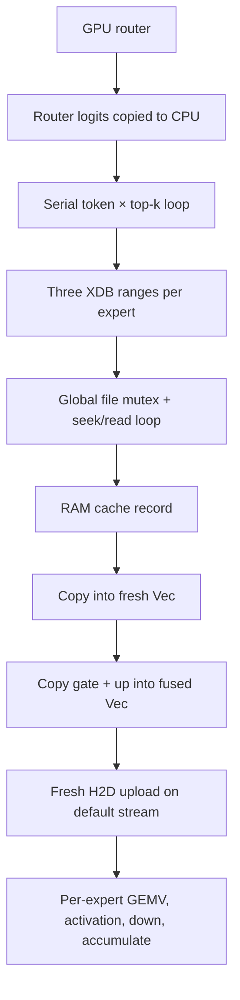
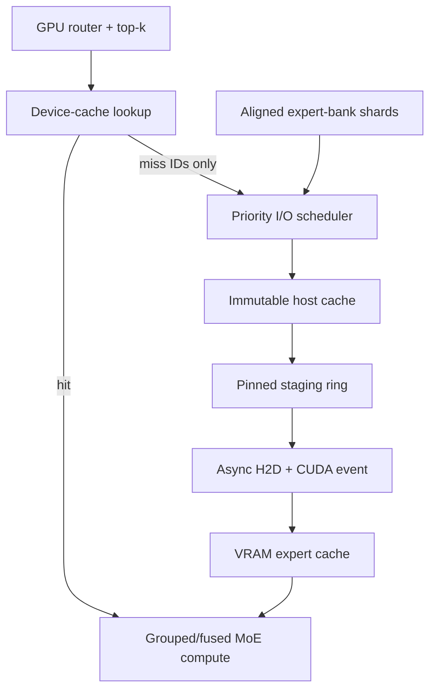

# OAIY streaming and token-speed improvement roadmap

> **Historical.** A design review of the engine from August 2026, with a status note of
> 19 September. It is not kept up to date, and it stays at this path because code comments
> refer to its phases (`docs/ROADMAP.md` Phase 0 to 3). For the engines today, see
> [ENGINES.md](ENGINES.md) and [DEEPSEEK_V41.md](DEEPSEEK_V41.md).

**Repository:** [`f2i-com/oaiy`](https://github.com/f2i-com/oaiy)  
**Reviewed revision:** [`1bea44aa0ea01061a1b593c6c58644f68fa7a856`](https://github.com/f2i-com/oaiy/tree/1bea44aa0ea01061a1b593c6c58644f68fa7a856)  
**Review date:** 2026-08-03  
**Primary goal:** faster local inference, especially sparse mixture-of-experts (MoE) models with hundreds of billions to trillions of total parameters, by streaming expert weights through RAM into one or more GPUs.

## Status update (2026-09-19)

The review below is kept as written, against the revision above. Since then:

- **Formats.** OAIY now reads only GGUF and safetensors, in place.
  - The XDB store and the native `.oaiy` container are gone, and so are the server and
    the converter.
  - Sections 2–4 (XDB2 storage, recovery, conversion) and 17 (native container) are
    retired, along with XDB-01/02 and NCUDA-01.
  - The goals of IO-01/02 carried over. GGUF experts are read from the `.gguf` with
    positioned reads (`gguf::FileSource`), and a layer's cold misses go out as one
    batch on a small thread pool (`GgufExpertStore::fetch_many`).
- **Landed in the GGUF path** (ids in the `VENDORED-LOCAL` comments):
  - PERF-01: bench phases and JSON schema (`oaiy-llm bench`), route traces (`--trace-out`).
  - CACHE-01: host-cache leases.
  - LAYOUT-01: direct gate/up views.
  - GPU-02: pinned staging and async uploads.
  - CACHE-02 / STREAM-01: a per-device VRAM expert cache.
  - MOE-01 / MOE-02: GPU top-k routing, and grouped MoE kernels.
  - SAMPLE-01: on-device greedy sampling.
- **DeepSeek-V4.1-Flash** (510 GB, safetensors; `docs/DEEPSEEK_V41.md`) put the
  target architecture to work at scale:
  - Per-GPU VRAM expert caches over two cards, with a contiguous layer split (MGPU-01's
    first step).
  - An LFRU RAM tier and a saved usage profile that warms both tiers.
  - Hybrid decode, where the CPU computes RAM-resident experts while the GPU runs the
    trunk.
  - ~29 tok/s warm. The measured limits now are RAM bandwidth, kernel-launch overhead
    and, for cold starts, the SSD, matching this review's "measure, then branch" rule.
- **Still open:**
  - KERNEL-01, ATTN-01, PLACE-01, SHARD-01 (striping the SSD tier over drives), and
    CUDA graphs.
  - Serving (SERVE-01), now over GGUF and safetensors.

## Executive summary

OAIY already has the right high-level idea for very large local MoE inference: keep the shared trunk resident, store experts compactly, and load only routed experts under a memory budget. The code is modular, correctness-conscious, and unusually easy to reason about for a young inference engine. The `WeightStore` abstraction, XDB object store, LFRU cache, native oaiy-container path, GGUF path, CUDA backend, and streamed-versus-resident equivalence tests are all useful foundations.

The current CUDA streaming implementation is not yet an overlapped SSD-to-GPU pipeline, however. Its hot path is effectively:

```text
serialized range reads
→ RAM cache
→ full expert-record copy
→ gate/up concatenation copy
→ new GPU allocation and upload
→ serial per-expert GPU kernels
```

Even a RAM-cache hit still rebuilds and uploads the expert. The implementation also pulls router logits to the CPU at every MoE layer, uses one default CUDA stream, performs many temporary allocations, and has no VRAM expert cache. These costs prevent the storage, PCIe copy engines, and GPU compute units from working concurrently.

The recommended strategy is:

1. **Establish the resident GPU ceiling first.** Qwen3-30B-A3B is reported at 16.9 GPU-resident tokens/s. Streaming cannot exceed the resident implementation, so allocation churn, tensor copies, launch count, and quantized kernels need profiling before storage work is judged.
2. **Make the existing path zero-copy and concurrent.** Replace cursor-based reads with positioned reads, collapse each contiguous range to one read, batch the exact top-k misses, return cache leases instead of copying records, and prepack gate/up so it is never concatenated during inference.
3. **Add a real GPU streaming hierarchy.** Use immutable host-cache records, a small pinned staging pool, separate transfer streams, CUDA events, fixed device slots, and a byte-budgeted VRAM expert cache.
4. **Move MoE control and execution onto the GPU.** Keep top-k routing on-device, group tokens by expert during prefill, fuse gate/up + activation and down + weighted accumulation, and make launch count independent of `sequence_length × top_k`.
5. **Treat dense and sparse models differently.** Streaming a dense 300B model means moving most of that model every token and will remain slow on consumer PCIe/NVMe. A 300B–1T sparse MoE with 20B–40B active parameters per token is a credible target if routing has useful locality and the hot set fits across GPU caches.
6. **Scale by placement, not by pretending VRAM is pooled.** Begin multi-GPU support with contiguous layer partitions and per-device expert caches. Add expert parallelism later. Avoid tensor parallelism across ordinary desktop PCIe until measured topology proves that collectives are worthwhile.

The most valuable first deliverable is not direct I/O or GPUDirect Storage. It is a benchmarked, zero-allocation steady-state path in which a VRAM cache hit performs **zero SSD bytes, zero host record copies, and zero host-to-device bytes**.

## Scope and confidence

This is a source-level architecture and performance review of the repository revision above. Existing benchmark results were taken from the repository README; the proposed speedups are engineering hypotheses until measured on the target machine. Numerical projections below are roofline bounds, not promises.

The review concentrated on:

- GGUF/XDB MoE streaming;
- the native oaiy-container streaming path;
- XDB physical layout and read behavior;
- host and device caching;
- CUDA execution and quantized kernels;
- attention, KV cache, placement, multi-GPU, and multi-NVMe scaling;
- benchmark quality and correctness gates.

The reviewed repository contains only one current commit, so this document evaluates the present design rather than performance regressions across history.

## What is realistically achievable

### Dense models versus sparse MoE models

For a dense model, every layer uses essentially every weight for every decoded token. Any weight that does not remain in VRAM must cross PCIe again on the next token; if it does not remain in RAM, it must also come from storage again. Kernel optimization cannot remove that physical traffic.

For a sparse MoE model, total parameters determine storage capacity, while **active expert bytes per token** determine the streaming burden. Shared attention, embeddings, routers, norms, and other dense trunk weights should remain resident. Only selected experts should move through the cache hierarchy.

Define:

- `A`: byte size of routed expert weights used by one token, measured from the actual quantized records;
- `h_v`: byte-weighted hit rate in the VRAM expert cache;
- `h_h`: conditional byte-weighted hit rate in the host cache after a VRAM miss;
- `B_p`: measured aggregate pinned-host-to-device bandwidth;
- `B_s`: measured aggregate storage bandwidth at the real request sizes and queue depth;
- `T_compute`: resident compute time for the token.

Then:

\[
D_{H2D}=A(1-h_v)
\]

\[
D_{SSD}=A(1-h_v)(1-h_h)
\]

With ideal overlap, the lower bound is:

\[
T_{token} \geq \max\left(T_{compute},\frac{D_{H2D}}{B_p},\frac{D_{SSD}}{B_s}\right)
\]

and therefore:

\[
tokens/s \leq \frac{1}{T_{token}}
\]

The current implementation is closer to the **sum** of storage, copies, upload, synchronization, and compute because those stages are mostly serialized. The target architecture should approach the maximum term.

### Illustrative bandwidth ceilings

The following table uses **0.60 bytes/parameter** as a planning estimate for a mixed Q4 model. That is deliberately more realistic than exactly 0.50 bytes/parameter, but the implementation must use the actual bytes in each tensor or expert record. It assumes an illustrative 25 GB/s effective H2D path and 12 GB/s effective storage path. Neither rate should be assumed without a machine-specific benchmark.

| Work touched per token | Approx. bytes/token | H2D-only ceiling at 25 GB/s | Cold-storage-only ceiling at 12 GB/s |
|---|---:|---:|---:|
| Dense 100B | 60 GB | 0.42 tok/s | 0.20 tok/s |
| Dense 300B | 180 GB | 0.14 tok/s | 0.07 tok/s |
| 32B-active MoE | 19.2 GB | 1.30 tok/s | 0.63 tok/s |
| 37B-active MoE | 22.2 GB | 1.13 tok/s | 0.54 tok/s |
| 104B-active MoE | 62.4 GB | 0.40 tok/s | 0.19 tok/s |

At an 80% byte-weighted VRAM-cache hit rate, the 37B-active example uploads 4.44 GB/token rather than 22.2 GB/token, lifting the H2D roof to about 5.6 tok/s before compute and other overheads. This is why the device cache matters much more than further tuning of a RAM-only cache.

Published parameter counts illustrate the distinction:

- [DeepSeek-V3 reports 671B total and 37B activated parameters per token](https://arxiv.org/abs/2412.19437).
- [One delta-attention linear MoE reports 1T total and 32B activated parameters](https://arxiv.org/abs/2507.20534).
- [Its 2.8T-class successor reports 2.8T total and 104B activated parameters](https://arxiv.org/abs/2607.24653).

These are not interchangeable workloads. A 2.8T-class model can fit on storage locally, but its much larger active set still demands aggressive low-bit packing, locality, prefetch, multiple drives, and/or multiple GPUs. Conversely, total model size can be enormous without proportionally increasing token traffic if the active set remains modest.

Dense offload can still be useful for throughput-oriented batching. [FlexGen demonstrated OPT-175B on a 16 GB GPU at about one token/s using an effective batch size of 144](https://arxiv.org/abs/2303.06865); that is a different objective from responsive batch-one chat. OAIY should explicitly report both latency and throughput modes.

### Practical target statement

- **Dense 300B+ batch-one interactive decoding:** possible to make functional, but generally sub-token-per-second unless an unusually large fraction remains in aggregate VRAM.
- **Sparse 300B–1T with roughly 20B–40B active:** a credible 1–5 tok/s target after device caching, overlap, grouped kernels, and suitable storage/topology. The benchmark must decide whether a given machine can reach it.
- **Sparse models near 100B active per token:** still very demanding. Low-bit/VQ expert formats and high device-cache reuse become mandatory rather than optional.
- **Prefill:** much more amenable to amortization. Load a dense layer once for a block of prompt tokens; for MoE, group all prompt rows by expert and load each distinct expert once per layer.

## Current strengths worth preserving

1. **Clear separation of storage and inference.** `WeightStore` makes it possible to improve the I/O backend without rewriting the native model implementation.
2. **Correctness-first testing.** The project has synthetic fixtures, format round trips, known-answer tests, and CUDA-versus-CPU comparisons. That is exactly the right base for aggressive kernel and pipeline changes.
3. **Compact expert representations.** The native oaiy-container path keeps packed VQ records instead of requiring the full model to be expanded.
4. **Existing cache policy and lookahead hooks.** The native forward path already records routing history and calls `hint`/`prefetch`; the missing piece is a scheduler that acts on them.
5. **A working resident CUDA path.** It provides a correctness reference and an upper bound for the same model/quantization.
6. **Reproducible CLI behavior.** Model conversion, planning, running, and statistics already have natural homes in one tool.

These should remain as reference implementations even if high-performance adapters require optional dependencies or carefully audited `unsafe` code.

## Current hot path and bottleneck map



The README says expert streaming can use “one aligned read per expert.” That describes the native expert-bank idea, but it is not currently true for converted GGUF/XDB2 inference. In that path, one expert is reconstructed from gate, up, and down ranges in separate tensor objects.

### Priority findings

| Priority | Finding | Why it matters | Primary evidence |
|---|---|---|---|
| P0 | No VRAM expert cache | A RAM hit still uploads every routed expert; PCIe remains in the critical path | [`cuda_quant_input`](https://github.com/f2i-com/oaiy/blob/1bea44aa0ea01061a1b593c6c58644f68fa7a856/crates/ggml-rs-cuda/src/backend.rs#L233-L242) |
| P0 | One CUDA stream for copies and compute | H2D for the next expert cannot overlap current expert compute | [`CudaBackend::new`](https://github.com/f2i-com/oaiy/blob/1bea44aa0ea01061a1b593c6c58644f68fa7a856/crates/ggml-rs-cuda/src/backend.rs#L149-L184) |
| P0 | Storage is effectively queue-depth one | A global mutex covers cursor-based reads; top-k reads serialize | [`Store2::get_range`](https://github.com/f2i-com/oaiy/blob/1bea44aa0ea01061a1b593c6c58644f68fa7a856/crates/xdb/src/store2.rs#L354-L393) |
| P0 | Three logical reads and many physical reads per expert | Gate/up/down are separate; 1 MiB “chunks” cause repeated seeks despite contiguous payload | [`GgufExpertStore::fetch`](https://github.com/f2i-com/oaiy/blob/1bea44aa0ea01061a1b593c6c58644f68fa7a856/crates/llama-rs/src/expert_stream.rs#L305-L343) |
| P0 | Cache hits copy full records | Each dispatch allocates a destination and copies the cached bytes while holding cache coordination | [`LayerStream::expert_weights`](https://github.com/f2i-com/oaiy/blob/1bea44aa0ea01061a1b593c6c58644f68fa7a856/crates/llama-rs/src/expert_stream.rs#L469-L491), [`Ecache::get`](https://github.com/f2i-com/oaiy/blob/1bea44aa0ea01061a1b593c6c58644f68fa7a856/crates/oaiy-engine/src/ecache.rs#L387-L482) |
| P0 | Gate/up fusion copies bytes in the hot path | “Zero-copy reconstruction” is only partial; compatible quantized halves are restacked | [`Weight::stack_axis0`](https://github.com/f2i-com/oaiy/blob/1bea44aa0ea01061a1b593c6c58644f68fa7a856/crates/llama-rs/src/loader.rs#L179-L228), [`FfnPair::from_halves`](https://github.com/f2i-com/oaiy/blob/1bea44aa0ea01061a1b593c6c58644f68fa7a856/crates/llama-rs/src/loader.rs#L397-L411) |
| P0 | Host-driven routing and expert loop | A D2H synchronization occurs at every MoE layer; launches scale with token × top-k | [`moe_forward_with_logits`](https://github.com/f2i-com/oaiy/blob/1bea44aa0ea01061a1b593c6c58644f68fa7a856/crates/llama-rs/src/moe.rs#L109-L169), [`streaming forward`](https://github.com/f2i-com/oaiy/blob/1bea44aa0ea01061a1b593c6c58644f68fa7a856/crates/llama-rs/src/expert_stream.rs#L499-L544) |
| P0 | CUDA allocations and real tensor clones occur during decode | Allocation/zeroing, D2D copies, and frees add synchronization and bandwidth costs | [`CudaBackend` allocation helpers](https://github.com/f2i-com/oaiy/blob/1bea44aa0ea01061a1b593c6c58644f68fa7a856/crates/ggml-rs-cuda/src/backend.rs#L198-L242), [`Tensor::clone`](https://github.com/f2i-com/oaiy/blob/1bea44aa0ea01061a1b593c6c58644f68fa7a856/crates/ggml-rs/src/tensor.rs#L204-L210) |
| P0 | Resident quant kernels are not yet the target ceiling | The kernel file identifies correctness-oriented F32 accumulation, and only some formats/shapes use cooperative decode paths | [`kernels.rs`](https://github.com/f2i-com/oaiy/blob/1bea44aa0ea01061a1b593c6c58644f68fa7a856/crates/ggml-rs-cuda/src/kernels.rs#L1-L6), [`linear_q`](https://github.com/f2i-com/oaiy/blob/1bea44aa0ea01061a1b593c6c58644f68fa7a856/crates/ggml-rs-cuda/src/backend.rs#L544-L649) |
| P1 | `hint` and `prefetch` are no-ops | Existing native lookahead cannot hide storage latency | [`Ecache::hint/prefetch`](https://github.com/f2i-com/oaiy/blob/1bea44aa0ea01061a1b593c6c58644f68fa7a856/crates/oaiy-engine/src/ecache.rs#L499-L503) |
| P1 | Long-context attention has a performance cliff | Above a shared-memory threshold, scores are materialized; sliding-window masking can round-trip through the CPU | [`CudaBackend::attention`](https://github.com/f2i-com/oaiy/blob/1bea44aa0ea01061a1b593c6c58644f68fa7a856/crates/ggml-rs-cuda/src/backend.rs#L1490-L1572) |
| P1 | KV is eagerly allocated in F32 | KV can consume the VRAM needed for the expert hot set | [`KvCache`](https://github.com/f2i-com/oaiy/blob/1bea44aa0ea01061a1b593c6c58644f68fa7a856/crates/llama-rs/src/kv_cache.rs#L78-L106) |
| P1 | Placement is opportunistic and single-GPU | A fixed 2 GiB margin and load-order placement do not represent real RAM/VRAM/KV needs; CLI hardcodes device 0 | [`try_to_device`](https://github.com/f2i-com/oaiy/blob/1bea44aa0ea01061a1b593c6c58644f68fa7a856/crates/llama-rs/src/loader.rs#L588-L610), [`llama_backend`](https://github.com/f2i-com/oaiy/blob/1bea44aa0ea01061a1b593c6c58644f68fa7a856/crates/oaiy-llm-cli/src/main.rs#L942-L956) |
| P1 | Generic XDB streaming supports only a narrow MoE set | The streaming opener dispatches Qwen3-MoE and Mixtral, not a general expert-layout interface for newer architectures | [`open_from_xdb_streaming`](https://github.com/f2i-com/oaiy/blob/1bea44aa0ea01061a1b593c6c58644f68fa7a856/crates/llama-rs/src/xdb_container.rs#L244-L295) |
| P1 | Benchmarks do not isolate the desired path | `oaiy-llm bench` is native-path oriented, while run statistics combine prompt and decode and omit GPU-cache/H2D metrics | [`cmd_bench`](https://github.com/f2i-com/oaiy/blob/1bea44aa0ea01061a1b593c6c58644f68fa7a856/crates/oaiy-llm-cli/src/main.rs#L1444-L1515) |

## Detailed source audit

### 1. GGUF/XDB expert reconstruction

`GgufExpertStore::fetch` issues a separate `read_range` for gate, up, and down. `XdbSource::read_range` walks the sorted tensor span list from the beginning to resolve a virtual GGUF offset, so a hot lookup is linear in the number of stored tensor spans. The retrieved record is then copied out of `Ecache` into a newly allocated `Vec` for every dispatch. `FfnPair::from_halves` can call `Weight::stack_axis0`, allocating and copying gate and up yet again.

For a model with many layers and top-k routing, this creates hundreds of large host allocations/copies per token. It also means a host-cache hit does not supply a stable object that the CUDA backend can retain.

**Improve it by:**

- resolving every expert to numeric offsets and lengths once at model open;
- binary-searching spans as an immediate compatibility fix;
- returning immutable cache leases rather than copying into caller buffers;
- storing gate/up already fused in the expert record;
- building device-ready subviews over one allocation rather than reconstructing `Weight` objects per dispatch.

### 2. XDB2 storage path

`Store2` stores the file and directory behind one `Mutex<Inner>`. `get_range` holds this mutex, seeks a shared cursor, and reads each virtual 1 MiB chunk separately. The chunks are metadata only; the payload is physically contiguous. Consequently, the loop adds syscalls without reducing bytes read or enabling independent verification.

The inference reader should be separated from the writer:

```rust
struct ReadStore2 {
    file: File,
    directory: Arc<ResolvedDirectory>,
}

struct WriteStore2 {
    state: Mutex<WriterState>,
}
```

Use safe platform-positioned reads where available:

- Unix: `std::os::unix::fs::FileExt::read_at`;
- Windows: `std::os::windows::fs::FileExt::seek_read`;
- fallback: a bounded pool of cloned file handles.

One contiguous requested range should become one positioned read. A `get_ranges`/`fetch_batch` API should allow the scheduler to submit all top-k records at once. The first implementation can use a portable blocking worker pool; `io_uring`, Windows overlapped I/O, direct I/O, and GPUDirect Storage can remain optional adapters.

### 3. XDB2 recovery correctness

There is a correctness issue to fix before using XDB2 as the authoritative copy of very large conversions. [`Store2::commit`](https://github.com/f2i-com/oaiy/blob/1bea44aa0ea01061a1b593c6c58644f68fa7a856/crates/xdb/src/store2.rs#L290-L302) appends a new directory and then updates the header pointer. The comment says bytes appended before a failed pointer update are harmless. On reopen, however, [`open_impl`](https://github.com/f2i-com/oaiy/blob/1bea44aa0ea01061a1b593c6c58644f68fa7a856/crates/xdb/src/store2.rs#L240-L278) reads from the old directory offset through the new end of file, and [`parse_directory`](https://github.com/f2i-com/oaiy/blob/1bea44aa0ea01061a1b593c6c58644f68fa7a856/crates/xdb/src/store2.rs#L567-L615) rejects trailing bytes. A crash before the root pointer update can therefore make the prior committed directory fail to open.

Also, `flush()` is not an fsync ordering barrier, and `len > dir_offset - offset` can underflow if a malformed entry has `offset > dir_offset`.

Fix the present format by recording or deriving the exact committed directory length, ignoring/truncating orphan tails safely, checking `offset > dir_offset` before subtraction, and using `sync_data` ordering. For a new format, prefer dual superblocks with generation, directory offset, directory length, and checksum; open the newest valid generation.

### 4. Conversion cost and layout

The current conversion stores one object per original tensor. Every `put` clones/updates metadata, appends a full new directory, and flips the commit pointer. Repeating this for thousands of tensors produces quadratic directory work and embeds obsolete directories. Per-object verification can reread and allocate very large objects.

Add a streaming `Store2Builder` that writes a temporary file, computes checksums incrementally, writes one directory, syncs, and atomically renames. Do not allocate a complete multi-gigabyte tensor merely to verify it.

For inference, retain XDB2 compatibility but add a specialized expert-bank extent or XDB3 layout:

```text
expert record (layer, expert)
┌──────────────┬──────────────────┬────────────┬──────────────┐
│ small header │ fused gate + up  │ down       │ alignment pad│
└──────────────┴──────────────────┴────────────┴──────────────┘
```

Each index entry should contain exact offsets, logical and padded lengths, shapes, dtypes, layout version, and checksum. Use at least 4 KiB alignment, configurable for the platform/device. Keep model metadata, tokenizer, and arbitrary non-expert tensors in the generic object layer.

### 5. Host expert cache

The current Ecache design is inherited from a pointer-oriented C implementation, but its safe Rust API returns bytes by copying them. A better contract is an RAII lease:

```rust
pub struct HostRecordLease {
    entry: Arc<CacheEntry>,
    range: Range<usize>,
}

pub trait HostExpertCache {
    fn acquire(&self, key: ExpertKey) -> CacheLookup<HostRecordLease>;
    fn admit(&self, key: ExpertKey, record: AlignedRecord) -> HostRecordLease;
}
```

The lease pins an entry only while a transfer or CPU computation uses it. Large copies, storage reads, uploads, and checksums must not run under the global metadata lock.

Additional cache improvements:

- an O(1) free list instead of scanning from slot zero;
- deletion-capable indexing instead of rebuilding the complete open-addressed table after every eviction;
- byte-capacity accounting or per-layer/size-class slabs rather than a model-wide maximum record size;
- frequency aging, protected and probationary segments, and optional per-layer minimums;
- a route-frequency sketch that survives eviction;
- demand reads prioritized over speculative prefetch;
- checksum verification once on SSD admission, not on every hit.

The README reports host-cache hit rates from 11% at 256 MiB to 69% at 4 GiB for Qwen3-30B-A3B. That proves useful routing locality exists, but a host hit currently removes disk traffic only. If a similar 69% byte-hit rate were achieved in a device cache, the expert-upload portion would have a theoretical `1 / (1 - 0.69) ≈ 3.2×` transfer reduction; total token speed would improve by less because compute and other work remain.

### 6. Asynchronous I/O and prefetch

Implement exact, non-speculative batch preparation first:

```rust
fn prepare_exact(
    &self,
    layer: u32,
    experts: &[ExpertId],
) -> Vec<PendingExpert>;
```

After routing determines top-k, submit every missing expert together. Wait only for the first dependency, then compute expert `i` while reading/uploading `i+1`. Represent state explicitly:

```text
Absent → Reading → HostReady → Uploading → DeviceReady → InUse
```

Only after exact top-k overlap is proven should the existing lookahead predictor drive speculative next-layer reads. [MoE-Infinity](https://arxiv.org/abs/2401.14361) is a useful reference for activation-aware expert caching and prefetch, but OAIY should validate prediction on its own route traces.

Track:

- useful prefetches;
- late prefetches that demand had to wait for;
- wasted/cancelled bytes;
- harmful prefetches that evicted a later demand hit;
- queue wait versus device latency;
- prediction precision and byte-weighted recall.

### 7. Pinned staging and CUDA overlap

A host cache should normally remain pageable; pinning many gigabytes can damage system behavior. Add a modest ring of aligned pinned staging slots sized for the largest in-flight records. NVIDIA’s guidance is explicit that asynchronous CPU/GPU transfers require pinned host memory and non-default streams for overlap ([CUDA C++ Best Practices Guide](https://docs.nvidia.com/cuda/cuda-c-best-practices-guide/index.html)).

Use at least:

- one compute stream per active device;
- one or more H2D transfer streams;
- two or three reusable pinned host slots per device/drive pipeline;
- two or three reusable device staging slots;
- CUDA events to connect upload completion, compute readiness, and safe slot reuse.

Do not globally synchronize after each upload. The compute stream should wait only on the event for the expert it needs. A steady-state decode token should perform no general-purpose CUDA allocation after warm-up.

### 8. VRAM expert cache

This is the most important streaming feature.

```rust
pub struct DeviceExpertKey {
    model_id: ModelId,
    device: DeviceId,
    layer: u32,
    expert: u32,
    dtype: QuantType,
    layout_generation: u32,
}

pub trait DeviceExpertCache {
    fn acquire(&self, key: &DeviceExpertKey) -> Option<DeviceExpertLease>;
    fn submit_upload(
        &self,
        key: DeviceExpertKey,
        host: HostRecordLease,
    ) -> PendingDeviceExpert;
}
```

Requirements:

- one device allocation per admitted expert record, with gate-up/down subviews;
- fixed or size-classed slabs to avoid fragmentation;
- byte-budgeted eviction, not entry-count-only eviction;
- entries remain pinned until their last completion event fires;
- cache key includes layout and quantization so transformed buffers cannot be confused;
- store kernel-ready packed layouts, not an intermediate representation requiring conversion on every hit;
- optional pinned hot experts based on an offline route trace;
- counters for hits, misses, evictions, bytes avoided, admission cost, and wait latency.

Expose separate budgets such as:

```text
--ram-budget
--host-expert-cache
--pinned-staging
--vram-budget
--vram-expert-cache
--kv-budget
```

A VRAM hit must be defined and tested as zero H2D bytes.

### 9. GPU allocator and tensor semantics

`CudaBackend::alloc` currently allocates zeroed output storage broadly, even when a kernel overwrites every element. Temporary tensors and clones can trigger device copies. Introduce:

- shared device allocation ownership with offset/shape/stride views;
- cheap clone and copy-on-write for mutable operations;
- uninitialized allocation for fully overwritten outputs;
- a model-owned memory arena or size-classed pool;
- event-based retirement before reuse;
- persistent scratch sized at load time;
- allocation, free, memset, and D2D-copy telemetry.

CUDA’s [stream-ordered allocator](https://docs.nvidia.com/cuda/cuda-programming-guide/04-special-topics/stream-ordered-memory-allocation.html) is a possible backend; a custom arena can remain the portable abstraction.

Acceptance condition: after warm-up, one-token decode performs no general-purpose host allocation for expert records and no general-purpose device allocation.

### 10. GPU router and grouped MoE execution

The router currently crosses to the CPU every MoE layer, then Rust loops through each token and selected expert. `top_k_softmax` allocates vectors, and each expert dispatch performs separate projection, activation, down-projection, and accumulation work.

For decode:

1. compute top-k and normalized route weights on the GPU;
2. keep IDs/weights on-device for resident/device-cache hits;
3. copy only the compact miss list to a pinned scheduler mailbox;
4. group available experts into a small number of launches;
5. fuse gate+up projection with activation;
6. fuse down projection with route-weighted accumulation.

For prefill:

1. route a prompt block;
2. sort/group token rows by expert;
3. load each distinct expert at most once for that layer/block;
4. run grouped GEMM rather than repeated GEMV;
5. scatter/reduce outputs back to token order.

Current top-8 decode can require roughly four operations per expert, or about 32 launches per MoE layer before other work. The grouped target should be a small constant per layer. Exact launch count depends on cache misses and chosen kernels, but it must no longer scale as `sequence × top_k` during prefill.

### 11. Quantized CUDA kernels

The repository’s resident 30B MoE result is the best warning not to treat I/O as the only bottleneck. The CUDA kernels should be profiled against a mature local-inference reference using the same GGUF, quantization, context, and sampling.

Recommended work:

- cover every supported quant format with an efficient batch-one GEMV path;
- use vectorized/coalesced loads and architecture-appropriate integer dot instructions;
- add tiled dequantize-and-GEMM/tensor-core paths for prompt blocks and batched decode;
- keep activations in FP16/BF16 where error gates allow it;
- cache compiled kernels by device architecture rather than compiling all NVRTC code at every startup;
- benchmark or adapt proven kernels from projects such as llama.cpp, CUTLASS, or cuBLASLt after license and layout review;
- retain a slow reference kernel for differential tests.

Do not set fixed speedup promises before profiling. A good gate is to reach a defined percentage of the best compatible reference runtime on the same machine, and to explain the remainder with kernel/event traces.

### 12. Attention and KV cache

Long context competes directly with the device expert cache. Current KV storage is F32 and eagerly sized to maximum length. As an illustration, an 80-layer GQA model with 8 KV heads and head dimension 128 requires:

\[
2 \times 80 \times 8 \times 128 \times 4 = 655{,}360\;bytes/token
\]

That is roughly 20 GiB at 32K tokens for one sequence before allocator overhead. FP16/BF16 halves it immediately.

Implement in this order:

1. FP16/BF16 KV storage with accuracy tests;
2. paged allocation rather than full eager reservation;
3. ring buffers for sliding-window layers;
4. Flash-style online-softmax decode attention to avoid score materialization and the shared-memory fallback;
5. prefix page sharing and eviction for server workloads;
6. optional INT8/FP8 KV after perplexity/long-context validation.

Also ensure the CLI context setting controls the real cache allocation; the generation path currently contains a hardcoded 2,048-token cache site.

### 13. Sampling and output transfer

The normal generation path copies the final vocabulary logits to the host. Large vocabularies can approach a megabyte of D2H data per token. The backend already contains device argmax support, so use it for greedy decoding. Add GPU repetition penalty, top-k, top-p, and multinomial sampling, returning one token or a small candidate set. Keep a CPU fallback for grammars or uncommon samplers.

This is not as important as expert weights, but it removes a recurring synchronization at the end of every token.

### 14. Memory placement planner

Current placement uploads tensors opportunistically in load order while preserving a fixed 2 GiB margin. The streamed model’s `resident_est` is based largely on on-disk tensor bytes minus experts. That misses:

- expansion of unsupported/F16/BF16 weights to F32;
- embeddings and tied output-head behavior;
- KV precision, context, batch, and paging;
- activations and CUDA workspaces;
- allocator/runtime headroom;
- host-cache metadata and padding;
- page-cache duplication;
- pinned staging and in-flight buffers;
- the distinction between RAM-resident and VRAM-resident weights.

Build a placement plan before allocating:

```rust
pub struct PlacementPlan {
    devices: Vec<DevicePlan>,
    resident_host_bytes: u64,
    host_cache_bytes: u64,
    pinned_bytes: u64,
    kv_bytes: u64,
    scratch_bytes: u64,
    os_headroom_bytes: u64,
}
```

Per device, reserve runtime/scratch and KV first, then keep the shared trunk, embeddings/output head, and hottest experts resident. The plan should use actual tensor storage sizes and report estimated versus measured RSS/VRAM after load. Enforce hard budgets within approximately 5%, or explain untracked memory explicitly.

Avoid persistent F32 expansion of large packed tensors. Add packed embedding gather and packed output-head GEMV paths where necessary.

### 15. Multi-GPU

The RTX 5090 has 32 GB of GDDR7 and the RTX 4090 has 24 GB according to NVIDIA’s product specifications ([RTX 5090](https://www.nvidia.com/en-us/geforce/graphics-cards/50-series/rtx-5090/), [RTX 4090](https://www.nvidia.com/en-us/geforce/graphics-cards/40-series/rtx-4090/)). A workstation with two 5090s and one 4090 therefore has 88 GB nominal VRAM, but that memory is not one transparent pool and usable cache space will be lower after KV, workspaces, and runtime allocations.

At startup, probe and benchmark:

- PCIe generation and width for every card under load;
- root-complex placement and NUMA node;
- `cudaDeviceCanAccessPeer` in both directions;
- H2D and D2H bandwidth concurrently to all devices;
- peer-copy bandwidth and latency;
- CPU-bounce bandwidth where peer access is unavailable;
- SSD-to-NUMA and SSD-to-GPU affinity.

NVIDIA documents explicit peer-access behavior rather than automatic pooling ([CUDA multi-GPU systems](https://docs.nvidia.com/cuda/cuda-programming-guide/03-advanced/multi-gpu-systems.html)).

Implement multi-GPU in this order:

1. **Contiguous layer/pipeline partitioning.** Each layer, its trunk weights, KV pages, and expert cache live on one GPU. Transfer only the hidden activation at partition boundaries. Weight partitions by measured capacity and speed, not layer count alone.
2. **Independent per-device prefetch.** Downstream devices can fetch/upload upcoming experts while upstream devices compute.
3. **Sharded expert cache.** Admit experts to the device that owns the layer; do not copy weights between GPUs on demand.
4. **Expert parallelism.** Dispatch selected experts to owner GPUs and reduce their hidden outputs only when topology and routing justify it.
5. **Tensor parallelism last.** It introduces collectives at every participating layer and often performs poorly across consumer PCIe without fast peer links.

For a heterogeneous 4090, benchmark two roles: a smaller layer partition in the main model, or a resident draft model for speculative decoding. For batch-one latency, the latter may be more valuable if the third GPU is poorly connected.

Expose `--devices 0,1,2`, per-device budgets, and a human-readable placement/topology report.

### 16. Multi-NVMe and direct storage

When the host cache misses often, one SSD may become the hard ceiling. Add an XDB manifest that maps expert records to shards. Possible layouts are:

- layer sharding, matching GPU layer ownership;
- expert-ID striping, spreading a layer’s top-k reads;
- measured route-balanced placement to avoid hot-shard concentration.

Each drive needs its own queue and latency/bandwidth counters. Co-locate worker threads, memory, SSDs, and GPUs by NUMA topology where possible.

Direct I/O should be optional and benchmarked against the OS page cache. It requires aligned offsets, lengths, and buffers, which the proposed expert-bank format supplies. GPUDirect Storage can reduce CPU staging on supported Linux configurations, but it does not change SSD bandwidth and should not be the baseline requirement. See NVIDIA’s [GPUDirect Storage documentation](https://docs.nvidia.com/gpudirect-storage/).

The current `std`-only plus `#![forbid(unsafe_code)]` rule is valuable for the reference engine, but high-performance platform I/O, pinned allocations, SIMD, and CUDA interop may require a separate optional crate with narrow, reviewed unsafe boundaries. Keep the safe implementation as a correctness fallback.

### 17. Native oaiy-container path

The native path contains the most interesting format for extremely large sparse models, but it remains CPU-only and its kernels are scalar. It also performs hot-path tensor-name formatting/lookups, clones `ModelCfg` during token/layer work, creates transient vectors, and uses scoped OS-thread creation rather than a persistent pool.

For 2.8T-class models:

- pre-resolve a typed `LayerWeights` table at open; never `format!`/search tensor names during decode;
- borrow configuration instead of cloning it per token/layer;
- allocate a reusable scratch plan for every layer/operator;
- use a persistent work-stealing or fixed thread pool for the CPU fallback;
- implement AVX2/AVX-512/NEON packed kernels;
- port KDA/MLA/VQ expert operations to the CUDA backend;
- keep packed VQ records packed through storage, RAM, PCIe, and VRAM;
- build LUTs and perform VQ matvec directly on-device rather than expanding weights.

This path should eventually share the same `IoScheduler`, host leases, pinned staging, device cache, placement planner, and telemetry as GGUF/XDB. Avoid building two unrelated streaming engines.

### 18. Server throughput

The current server supports native `.oaiy` models, while GGUF/XDB support is pending. Once single-request correctness and latency are stable:

- add GGUF/XDB/CUDA to the server;
- implement continuous batching;
- group requests by layer/expert opportunities;
- share immutable model and expert-cache state;
- page KV per sequence and share prefix pages;
- add backpressure based on pinned, device-cache, and KV budgets;
- report per-request TTFT and inter-token latency, not just aggregate throughput.

Continuous batching can materially improve throughput because one expert load can serve multiple rows. It should not be used to hide poor batch-one behavior in benchmark reports.

### 19. Model and expert-layout coverage

The generic GGUF/XDB streaming opener currently specializes the streamed path for Qwen3-MoE and Mixtral. That is enough to validate the mechanism, but not enough to claim general support for contemporary hundred-billion-plus MoE models. Architectures differ in shared experts, routing normalization, expert tensor orientation, attention, activation, quantization, and auxiliary routing behavior.

Introduce an architecture-owned descriptor rather than adding more model-name branches:

```rust
pub trait MoeStreamingLayout {
    fn layer_count(&self) -> usize;
    fn expert_count(&self, layer: usize) -> usize;
    fn top_k(&self, layer: usize) -> usize;
    fn resolve_record(&self, layer: usize, expert: usize) -> ExpertRecordSpec;
    fn routing_semantics(&self, layer: usize) -> RoutingSpec;
}
```

Keep tensor-layout description separate from numerical execution. Add one architecture at a time with a resident-versus-streamed logit test and a real-model smoke test. Do not use total-parameter claims in release notes until at least one genuine 100B+ target completes the full benchmark/correctness matrix.

## Target architecture



The scheduler should maintain separate demand and speculative queues. The GPU path should use stable addresses so later CUDA Graph capture becomes possible. [CUDA Graphs](https://docs.nvidia.com/cuda/cuda-programming-guide/04-special-topics/cuda-graphs.html) can reduce launch overhead once allocation churn, host routing, and changing expert pointers have been removed; graph capture should not precede those changes.

## Phased implementation plan

### Phase 0 — observability and a trustworthy roofline

**Goal:** know whether every token is limited by compute, storage, PCIe, allocation, launch, or synchronization.

Tasks:

- make `oaiy-llm bench` exercise resident GGUF, streamed XDB, and native `.oaiy`, on CPU and CUDA;
- time model load, conversion, TTFT, prefill, and steady-state decode separately;
- synchronize the backend explicitly at timing boundaries;
- add CUDA event timings and NVTX ranges per layer/stage;
- report actual bytes/token from storage, host copies, H2D, D2D, and VRAM reads;
- count syscalls, queue depth, cache hits by **bytes and entries**, allocations, memsets, and launches;
- record route traces for deterministic offline replay;
- capture model hash, quantization mix, context, batch, device, clocks, driver/toolkit, PCIe topology, storage layout, temperatures, and throttling;
- fix the README hardware ambiguity: it says “RTX 5090, 24 GiB VRAM,” although that product has 32 GB; state whether 24 GiB was peak use, a limit, free memory, or another device.

Acceptance:

- repeat-run coefficient of variation below 5% after warm-up;
- measured byte/time counters predict observed throughput within ±20%;
- resident and streamed prefill/decode are separately visible;
- one JSON result schema supports comparison in CI and across machines.

### Phase 1 — remove avoidable serialization and copies

**Goal:** a warm host-cache hit performs no record-sized allocation or copy; cold reads reach useful NVMe queue depth.

Tasks:

- fix XDB2 recovery semantics and add crash-injection tests;
- add the bulk conversion writer;
- replace chunk-loop `seek/read` with one positioned read per contiguous range;
- split read-only metadata from the writer lock;
- binary-search or pre-resolve XDB tensor spans;
- add `fetch_batch` and a bounded I/O worker pool;
- return immutable Ecache leases;
- prepack or view fused gate/up without `stack_axis0`;
- preallocate host metadata/scratch used per dispatch;
- make existing `prefetch` perform real low-priority work.

Acceptance:

- a host-cache hit copies zero record bytes;
- no per-expert heap allocation after warm-up;
- cold reads reach at least 70% of the measured raw-drive throughput for the same request sizes;
- queue-depth scaling continues until the drive saturates;
- resident and streamed outputs retain the current equivalence contract.

### Phase 2 — pinned staging, overlap, and the VRAM expert cache

**Goal:** cache hits remove PCIe traffic and misses are pipelined.

Tasks:

- implement reusable pinned host and device slots;
- add transfer streams and event-based dependencies;
- add a per-device, byte-budgeted `DeviceExpertCache`;
- store a whole GPU-ready expert record in one device allocation;
- exact-batch prepare all top-k experts;
- compute expert `i` while expert `i+1` transfers;
- add device-cache admission/eviction metrics and policies;
- integrate route-history prefetch only after demand overlap works.

Acceptance:

- a VRAM hit performs zero H2D bytes;
- a demand miss performs no general-purpose allocation;
- at least 70% of transferable time is overlapped where dependencies permit;
- achieved streaming speed reaches at least 70% of the measured compute/PCIe/SSD roofline;
- with a sufficiently warm device cache, Qwen3-30B-A3B streaming reaches at least 80% of its resident decode speed.

### Phase 3 — GPU-resident routing and fused/grouped execution

**Goal:** eliminate per-layer CPU routing barriers and make prefill reuse expert loads.

Tasks:

- GPU top-k and softmax;
- compact miss-list mailbox;
- fused gate-up + activation;
- fused down + route-scale accumulation;
- grouped expert decode;
- token-to-expert grouping and grouped GEMM for prefill;
- memory arena and cheap tensor views;
- GPU sampling;
- benchmark and replace weak quantized kernel paths.

Acceptance:

- no full router-logit D2H copy per layer;
- batch-one MoE launches are a small constant per layer;
- prefill loads each distinct expert at most once per layer/block;
- at least 3× prefill speedup at 512 prompt tokens, or 60% of resident reference prefill throughput;
- resident decode reaches the agreed fraction of a pinned compatible reference runtime.

### Phase 4 — expert-bank format, compact KV, and long context

**Goal:** remove the physical-layout tax and keep context from evicting the expert hot set.

Tasks:

- introduce aligned expert-major extents with migration/versioning;
- add per-record checksums and optional direct I/O adapter;
- add FP16/BF16 and paged KV;
- add ring buffers for sliding-window layers;
- implement Flash-style decode attention;
- update the placement planner with exact KV and cache budgets.

Acceptance:

- one ordinary read per expert record;
- no abrupt attention fallback at 2K, 8K, 32K, or 128K context;
- selected KV precision passes perplexity/logit and long-context tests;
- peak RAM and VRAM remain within documented budget tolerance.

### Phase 5 — multi-GPU and multi-NVMe

**Goal:** increase resident hot-set capacity and aggregate transfer bandwidth safely.

Tasks:

- topology discovery and bandwidth microbenchmarks;
- explicit device selection and per-device budgets;
- contiguous layer partitioning with local KV/cache ownership;
- overlapped downstream prefetch;
- XDB shard manifest and per-drive queues;
- measured load balancing;
- optional expert parallelism;
- topology-gated peer copies and pinned-host fallback.

Acceptance:

- two matched GPUs provide at least 1.6× throughput on an out-of-core workload versus the best single GPU, or the benchmark report explains the measured roofline blocker;
- partition time imbalance below 10%;
- a heterogeneous third GPU joins the main path only if it improves batch-one decode by at least 15%;
- no undocumented host-bounce transfers;
- outputs pass the single-versus-multi-GPU correctness gate.

### Phase 6 — Native-target CUDA path and serving

**Goal:** use the native packed representation for the largest sparse models and amortize loads across requests.

Tasks:

- typed load-time weight registry;
- packed VQ GPU expert kernels;
- KDA/MLA CUDA implementation;
- shared streaming scheduler/cache hierarchy;
- GGUF/XDB CUDA server support;
- continuous batching and prefix-aware paged KV;
- speculative decoding or multi-token prediction after correctness baselines.

Acceptance:

- the packed expert representation is never fully dequantized in the streaming path;
- the native 2.8T-class target's execution is GPU-backed end to end;
- serving reports TTFT, per-token latency distributions, and throughput separately;
- batch-one measurements remain published beside batched throughput.

## Benchmark specification

### Microbenchmarks

#### Storage

- record sizes: 256 KiB, 1 MiB, 2 MiB, 8 MiB, 16 MiB, 32 MiB, 64 MiB;
- random, layer-sequential, and recorded route-trace access;
- queue depths: 1, 2, 4, 8, 16, 32;
- cold OS cache, warm OS cache, explicit host cache, and optional direct I/O;
- one range versus three ranges versus one packed expert record;
- single drive and each supported shard mapping;
- requested bytes, physical bytes, syscalls, p50/p95/p99 latency, CPU time, and GB/s.

#### Cache

- lookup latency and contention;
- current copy-out versus lease API;
- eviction time versus slot count;
- entry-hit and byte-hit rates;
- LFRU versus segmented/TinyLFU-style admission on real route traces;
- useful, late, wasted, and harmful prefetch bytes;
- budgets swept logarithmically from a few records to the full hot set.

#### PCIe and device cache

- pageable versus pinned H2D for real expert sizes;
- allocate-per-copy versus fixed slots;
- one stream versus transfer + compute streams;
- simultaneous H2D to all GPUs;
- device hit, host hit, and cold SSD miss paths;
- peer copy and host-bounce paths by GPU pair;
- event, allocation, and stream synchronization overhead.

#### GPU kernels

- every supported quantization and representative matrix shape;
- resident versus transient-upload weights;
- GEMV decode, grouped GEMV, GEMM prefill, and batched decode;
- gate/up, activation, down, accumulation separately and fused;
- router top-k on CPU versus GPU;
- attention at 2K/8K/32K/128K;
- sampling for small and large vocabularies.

### End-to-end matrix

Test at least:

- Qwen3-30B-A3B as the regression model;
- one genuine 100B+ sparse MoE;
- synthetic expert stores with 0.5/2/8/16/32/64 GB active bytes per token;
- resident GGUF, current streamed XDB, revised streamed XDB, and native `.oaiy` where compatible;
- CPU, each GPU individually, and supported multi-GPU plans;
- cold, RAM-warm, and VRAM-warm starts;
- host and device cache-budget sweeps;
- prompt lengths 128/512/2K/8K;
- decode at 0/2K/8K/32K/128K existing context;
- batch sizes 1/2/4/8 and continuous serving;
- real text corpora, recorded route traces, and uniform/Zipf synthetic routing.

### Required result fields

```json
{
  "revision": "git sha",
  "model_hash": "sha256",
  "model_total_bytes": 0,
  "active_expert_bytes_per_token": 0,
  "resident_host_bytes": 0,
  "resident_device_bytes": [],
  "kv_bytes": [],
  "host_cache_byte_hit_rate": 0.0,
  "device_cache_byte_hit_rate": [],
  "ssd_bytes_per_token": 0,
  "host_copy_bytes_per_token": 0,
  "h2d_bytes_per_token": [],
  "kernel_launches_per_token": 0,
  "host_allocations_per_token": 0,
  "device_allocations_per_token": 0,
  "prefill_tokens_per_second": 0.0,
  "decode_tokens_per_second": 0.0,
  "ttft_ms": 0.0,
  "inter_token_ms_p50": 0.0,
  "inter_token_ms_p95": 0.0,
  "inter_token_ms_p99": 0.0,
  "peak_rss_bytes": 0,
  "peak_vram_bytes": []
}
```

Add measured stage durations, topology, storage, thermals, clocks, driver/toolkit, quantization mix, context, batch, sampler, and prompt/route-trace identifier around this minimum schema.

### Hundreds-of-billions proof gate

A candidate configuration passes only if:

- the model runs without OS swapping or uncontrolled page-cache pressure;
- cold, RAM-warm, and VRAM-warm results are reported separately;
- actual active bytes/token and tier-specific hit rates are shown;
- measured throughput reaches at least 70% of the computed roofline;
- batch-one decode reaches 1 tok/s minimum, 3 tok/s goal, or 5 tok/s stretch for the chosen sparse model;
- if the roofline itself is below the goal, the team changes quantization, active model size, device-cache budget, batching mode, or hardware rather than micro-optimizing the wrong layer.

## Correctness and reliability gates

Storage/cache pipeline changes should remain bit-identical because they do not intentionally change arithmetic. Fused kernels and reduced-precision/tensor-core paths may reorder floating-point operations, so define explicit tolerances instead of claiming bit identity universally.

Add tests for:

- resident GPU versus VRAM-cache hit versus host-cache hit versus SSD miss logits;
- forced eviction at every host/device cache size, including one-entry cases;
- mixed quantization and variable expert sizes;
- out-of-order I/O and H2D completion;
- cancellation and concurrent requests;
- corrupt, truncated, mis-keyed, and wrong-layout records;
- crash at each XDB commit boundary;
- exact route IDs and bounded route-weight error;
- per-layer activation checkpoints;
- single-token and grouped prefill equivalence;
- KV paging, reduced precision, sliding-window wraparound, and long context;
- single-GPU versus every multi-GPU partition;
- cache-entry lifetime until CUDA completion events fire;
- no reuse-after-free under stress and sanitizer tooling where available.

Suggested numerical gates for non-bitwise kernels:

- maximum absolute and relative logit error;
- greedy-token agreement over a fixed corpus;
- router top-k set and ordering agreement;
- perplexity delta on a fixed evaluation set;
- long-context retrieval/needle tests;
- deterministic mode using reference accumulation for debugging.

## Suggested pull-request sequence

Keep changes small enough to benchmark and bisect:

1. **PERF-01:** unified benchmark phases, JSON schema, synchronization, topology and route traces.
2. **XDB-01:** crash recovery fix and fault-injection tests.
3. **XDB-02:** bulk `Store2Builder` conversion.
4. **IO-01:** positioned coalesced reads and read-only store split.
5. **IO-02:** resolved numeric expert index and batched fetch API.
6. **CACHE-01:** immutable host-cache leases and O(1) free/index changes.
7. **LAYOUT-01:** direct gate/up views, then versioned expert-major packed records.
8. **GPU-01:** cheap device tensor views and steady-state memory arena.
9. **GPU-02:** pinned staging, transfer streams, and event-safe slot reuse.
10. **CACHE-02:** per-device VRAM expert cache and byte-hit telemetry.
11. **STREAM-01:** exact top-k pipeline and overlap.
12. **MOE-01:** GPU router/top-k and compact miss mailbox.
13. **MOE-02:** grouped/fused decode and grouped prefill.
14. **KERNEL-01:** quantized GEMV/GEMM parity with a pinned reference.
15. **ATTN-01:** FP16/BF16 paged KV and Flash-style attention.
16. **SAMPLE-01:** GPU sampling.
17. **PLACE-01:** explicit tier-aware planner and budget enforcement.
18. **MGPU-01:** topology probe and contiguous layer partitions.
19. **SHARD-01:** multi-NVMe expert-bank manifest.
20. **NCUDA-01:** packed VQ/KDA/MLA device path.
21. **SERVE-01:** GGUF/XDB serving and continuous batching.

Each PR should include before/after machine-readable benchmark artifacts for the path it changes and should not combine a storage layout change with a new numerical kernel.

## Decision rules and risks

| Decision | Rule |
|---|---|
| Direct I/O | Keep only if it wins on recorded route traces after alignment and queue depth are correct. |
| GPUDirect Storage | Add only after the normal pinned pipeline reaches its measured roofline and the target OS/topology supports it. |
| Predictive prefetch | Enable by default only when useful bytes substantially exceed wasted bytes and demand p95 does not regress. |
| Device cache policy | Optimize byte-weighted misses and stall time, not entry-hit count alone. |
| Tensor parallelism | Use only when measured peer/collective cost beats layer partitioning for the chosen batch. |
| Third heterogeneous GPU | Put it in the main path only when end-to-end latency improves; otherwise test it as a draft GPU. |
| Reduced KV precision | Ship only after perplexity and long-context gates pass. |
| New quant kernel | Compare against reference logits and a mature implementation on identical inputs. |
| CUDA Graphs | Start after addresses, allocation behavior, and routing control flow are stable. |
| Dense 300B+ goal | Treat functionality and batched throughput separately from interactive batch-one speed. |

Major risks:

- Consumer multi-GPU PCIe bandwidth is topology-dependent and may not add linearly.
- A device cache can deadlock or corrupt data if eviction ignores asynchronous kernel lifetimes.
- Bad prefetch can reduce performance by evicting demand-hot experts or consuming I/O queue depth.
- Pinning the whole host cache can starve the OS; use a bounded staging pool.
- Direct I/O can be slower than the page cache for small or highly reused records.
- A new format needs migration, versioning, checksums, and crash recovery before performance claims.
- F32 KV can silently consume nearly all potential expert-cache VRAM at long context.
- Aggregate tokens/s can hide poor TTFT and batch-one latency.
- Total parameter count is a poor performance headline; always publish total bytes, active bytes/token, and tier-specific residency.

## The first three changes to make

If work starts immediately, do these first:

1. **Add a streaming-CUDA benchmark and trace schema.** Separate resident, RAM-warm, VRAM-warm, and cold-NVMe paths; measure bytes/token and every synchronization. This tells the team whether the 16.9 tok/s resident ceiling or the streaming path is the first limiter.
2. **Make storage/cache delivery zero-copy and concurrent.** One positioned read per range, batch the exact top-k, return host leases, and eliminate hot-path gate/up restacking. This is low-to-medium risk and makes later overlap possible.
3. **Build pinned staging plus a per-device VRAM expert cache.** A device hit must launch directly from stable packed storage with zero H2D. This is the architectural change most likely to transform streaming token speed.

After those three changes, rerun the roofline. If compute is dominant, prioritize grouped/fused kernels. If PCIe is dominant, improve device-cache locality or quantization. If storage is dominant, improve prefetch and shard across drives. This measurement-driven branch prevents months of work on a subsystem that is no longer on the critical path.

## Final recommendation

OAIY can become a strong local sparse-MoE engine, including models with hundreds of billions of total parameters, but it should define success by **active bytes per token** rather than total parameter count. The present architecture validates correctness and the basic idea; the next architecture needs stable cached objects, explicit pipeline stages, and end-to-end backpressure.

The central invariant should be:

> A hot expert is read once, transformed once, uploaded once, and reused many times. A cold expert is fetched, transferred, and computed through an overlapped bounded pipeline without record-sized copies or allocations.

Build that invariant first. Direct storage, predictive policies, exotic kernels, and large-scale serving then become incremental optimizations instead of attempts to compensate for a synchronous data path.
