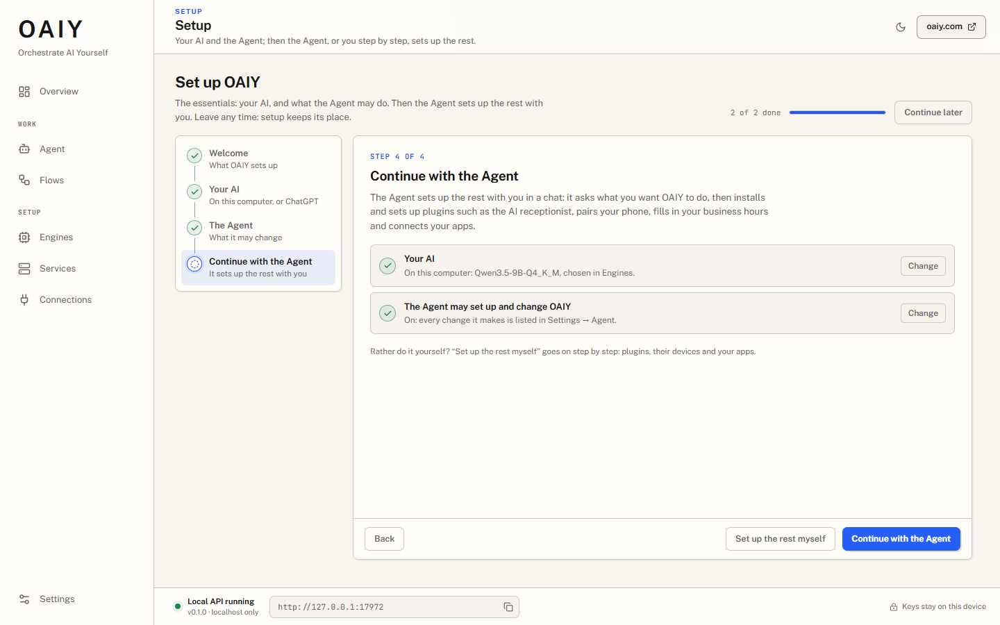

# Setting up OAIY

OAIY sets up the essentials first: the AI the Agent thinks with, and whether the Agent
may change OAIY for you. After that, the Agent sets up the rest with you in a chat, or
you go on step by step yourself.

## The first run

On a new desktop the setup wizard opens by itself. A desktop that already shows signs
of use (a language model chosen in Engines, ChatGPT signed in, a plugin installed) is
recorded as set up and never gets a surprise wizard. **Continue later** leaves the
wizard at any time; it keeps its place.

1. **Welcome.** What OAIY sets up, in three lines.
2. **Your AI.** What the Agent thinks with:
   - **On this computer:** the language model chosen in OAIY's engines. With none chosen
     yet, the wizard offers the engine catalog's recommended model to download. Nothing
     here names a model of its own: the catalog and your choice in Engines decide.
   - **ChatGPT:** your ChatGPT account, through OAIY's Codex connection. Nothing to
     download; your plan's limits apply.

   The one that suits this computer comes first: this computer when a model is chosen
   in Engines or its largest GPU has the memory the recommended model needs, ChatGPT
   otherwise. Either can be chosen, and changed later in **Settings → Agent**.
3. **The Agent.** One switch, on by default: **Let the Agent set up and change OAIY for
   you.** When it is on, the Agent can install and set up plugins, choose models, start
   and stop services and change settings when you ask it to, and every change it makes
   is listed in Settings → Agent. When it is off, the Agent can still look, but not
   change anything.
4. **Continue with the Agent.** Opens the Agent in a conversation called **Set up
   OAIY**. **Set up the rest myself** goes on step by step instead.

## With the Agent: "Set up OAIY"

The Agent starts by reading how OAIY stands (what is installed, running and set up,
and whether it may change things), asks what you want OAIY to do, and then does it one
step at a time with OAIY's own tools, checking each step before the next. For example,
for "answer my business phone" it installs the phone plugin, fills in your business's
hours and services, and makes sure the voice and the language model are ready.

Some steps are yours to do on screen: accepting what a plugin may do, pairing a phone
with a code, signing in. For those, the Agent opens the right page of the dashboard,
tells you what to do there, and waits for you. It never accepts a plugin's permissions
for you. The tools it uses are described in [The Agent's control of OAIY](AGENT_CONTROL.md).

## Step by step, yourself

**Set up the rest myself** adds these steps to the wizard:

- **Plugins:** choose the plugins to install from OAIY's catalog (the AI receptionist,
  for example). Each installed plugin then gets a setup of its own, below.
- **A plugin's own setup:** the steps its manifest declares, starting with what it may
  do (see [Plugins](PLUGINS.md#the-setup-wizard)).
- **Connect an app:** FormLogic, or another app that pairs with OAIY.
- **Done.**

A plugin installed later, from **Connections → Plugins**, goes through its own setup as
soon as it is installed.

## What counts as set up

The wizard's ticks are worked out again every time from what is really there: a service
installed, a model chosen in Engines, a plugin's own checks passing (the phone paired,
consent given). A plugin whose checks all pass counts as set up without clicking through
its wizard, and a step someone undoes shows as not done again. Only what cannot be
checked live is recorded (`<data>/setup.json`): where the first-run wizard is, what was
skipped, and which setup version of each plugin was finished.

## Settings → Agent

- **What the Agent may do:** the same switch as the wizard's.
- **What the Agent changed:** every change the Agent made to OAIY, newest first, with
  the conversation it came from. A refused change is listed too.
- **The Agent's model:** OAIY's engine (the model chosen in Engines) or ChatGPT, with a
  model from ChatGPT's list. Phone calls keep their own fast route either way.

Setup can be run again from **Settings** at any time.
